> **Keywords:** require network timeout, DoS, availability, security, ESLint rule, [CWE-400](https://cwe.mitre.org/data/definitions/400.html), axios, fetch, hang
> **CWE:** [CWE-400: Uncontrolled Resource Consumption](https://cwe.mitre.org/data/definitions/400.html)  
> **OWASP Mobile:** [OWASP Mobile Top 10 M9: Insecure Data Storage](https://owasp.org/www-project-mobile-top-10/)

ESLint Rule: require-network-timeout. This rule is part of [`eslint-plugin-maintainability`](https://www.npmjs.com/package/eslint-plugin-maintainability).

## Quick Summary

| Aspect         | Details                                     |
| -------------- | ------------------------------------------- |
| **Severity**   | High (Availability Risk)                    |
| **Auto-Fix**   | ❌ No (requires business logic for timeout) |
| **Category**   | Quality |
| **ESLint MCP** | ✅ Optimized for ESLint MCP integration     |
| **Best For**   | Services making external API calls          |

## Vulnerability and Risk

**Vulnerability:** Uncontrolled resource consumption (specifically request hanging) occurs when network requests are made without a defined timeout.

**Risk:** If a downstream service becomes unresponsive or extremely slow, your application threads (or event loop connections) can be held open indefinitely. This can lead to a cascading failure where your service runs out of available connections/memory and becomes unresponsive (Denial of Service - DoS).

## Error Message Format

The rule provides **LLM-optimized error messages** (Compact 2-line format) with actionable security guidance:

```text
🔒 CWE-400 OWASP:M9 | Missing Network Timeout detected | HIGH [DoS,CascadingFailure]
   Fix: Add a timeout to your network request (e.g., timeout: 5000) | https://cwe.mitre.org/data/definitions/400.html
```

### Message Components

| Component                 | Purpose                | Example                                                                                                             |
| :------------------------ | :--------------------- | :------------------------------------------------------------------------------------------------------------------ |
| **Risk Standards**        | Security benchmarks    | [CWE-400](https://cwe.mitre.org/data/definitions/400.html) [OWASP:M9](https://owasp.org/www-project-mobile-top-10/) |
| **Issue Description**     | Specific vulnerability | `Missing Network Timeout detected`                                                                                  |
| **Severity & Compliance** | Impact assessment      | `HIGH [DoS,CascadingFailure]`                                                                                       |
| **Fix Instruction**       | Actionable remediation | `Add a timeout to your network request`                                                                             |
| **Technical Truth**       | Official reference     | [Uncontrolled Resource Consumption](https://cwe.mitre.org/data/definitions/400.html)                                |

## Rule Details

This rule analyzes network request calls (e.g., `axios.get`, `fetch`) and flags those where no timeout option is explicitly provided.

```mermaid
%%{init: {
  'theme': 'base',
  'themeVariables': {
    'primaryColor': '#f8fafc',
    'primaryTextColor': '#1e293b',
    'primaryBorderColor': '#334155',
    'lineColor': '#475569',
    'c0': '#f8fafc',
    'c1': '#f1f5f9',
    'c2': '#e2e8f0',
    'c3': '#cbd5e1'
  }
}}%%
flowchart TD
    A[Network Request] --> B{Has timeout config?}
    B -->|Yes| C[✅ Safe Connection Lifecycle]
    B -->|No| D[🚨 Potential Resource Hang / DoS]
    D --> E[💡 Suggest explicit timeout value]
```



### Why This Matters

| Issue               | Impact                             | Solution                                            |
| ------------------- | ---------------------------------- | --------------------------------------------------- |
| 🛡️ **Availability** | Service stays alive during outages | Always bound external calls with strict timeouts    |
| 💥 **DoS**          | Cascading failures across system   | Implement a circuit breaker or simple timeout logic |
| 🕵️ **Detection**    | Hard-to-debug "hanging" processes  | Use timeouts to get clear error states for logging  |

## Configuration

This rule accepts an options object to define what constitutes a network call:

```typescript
{
  "rules": {
    "maintainability/require-network-timeout": ["error", {
      "timeoutThreshold": 10000, // (Informational only in current version)
      "additionalMethods": ["customApiCall"]
    }]
  }
}
```

## Examples

### ❌ Incorrect

```javascript
// Axios call without timeout
axios.get('https://api.thirdparty.com/data');

// Fetch call without signal/timeout
fetch('https://api.thirdparty.com/data');
```

### ✅ Correct

```javascript
// Axios call with explicit timeout
axios.get('https://api.thirdparty.com/data', {
  timeout: 5000, // 5 second timeout
});

// Fetch call with AbortController for timeout
const controller = new AbortController();
const id = setTimeout(() => controller.abort(), 5000);

fetch('https://api.thirdparty.com/data', {
  signal: controller.signal,
}).finally(() => clearTimeout(id));
```

## Known False Negatives

The following patterns are **not detected** due to static analysis limitations:

### Global Defaults

**Why**: If you set axios defaults globally (`axios.defaults.timeout = 5000`), individual calls might still be flagged because ESLint cannot see the global configuration state.

**Mitigation**: Use `// eslint-disable-next-line` for calls where global timeouts are guaranteed, or use a custom axios instance with timeouts pre-configured.

### Non-Standard Wrappers

**Why**: If network calls are deeply nested in custom wrapper functions that the rule does not recognize.

**Mitigation**: Add your custom wrapper names to the `additionalMethods` configuration.

## References

- [CWE-400: Uncontrolled Resource Consumption](https://cwe.mitre.org/data/definitions/400.html)
- [Axios Documentation - Request Config (timeout)](https://axios-http.com/docs/req_config)
- [MDN - Fetch API (AbortController)](https://developer.mozilla.org/en-US/docs/Web/API/AbortController)
