> **Keywords:** no-instanceof-array, Array.isArray, type checking, cross-realm, iframes, web workers, reliability, ESLint rule, modernization

Forbid use of `instanceof Array` in favor of `Array.isArray()`. This rule is part of [`eslint-plugin-modernization`](https://www.npmjs.com/package/eslint-plugin-modernization) and ensures robust array detection in environments with multiple execution contexts.

## Quick Summary

| Aspect         | Details                                      |
| -------------- | -------------------------------------------- |
| **Severity**   | Medium (Reliability)                         |
| **Auto-Fix**   | ❌ No                                        |
| **Category**   | Modernization                                |
| **ESLint MCP** | ✅ Optimized for ESLint MCP integration      |
| **Best For**   | All projects, especially those using iframes |
| **Contexts**   | Cross-realm compatibility                    |

## Why `instanceof Array` is Unreliable

**Problem:** Each JavaScript environment (realm) has its own global objects, including `Array`. An array created in one iframe will not be an `instance` of the `Array` constructor in another iframe or the main window.

**Risk:** `value instanceof Array` will return `false` if `value` was created in a different realm, even if it is a valid array. This leads to subtle bugs where data processing logic is skipped or errors are thrown because an array wasn't recognized.

## Error Message Format

The rule provides **LLM-optimized error messages** with actionable technical guidance:

```text
⚠️ MODERNIZATION | Instanceof Array detected | MEDIUM
   Fix: Replace "value instanceof Array" with "Array.isArray(value)" for cross-realm compatibility | https://developer.mozilla.org/en-US/docs/Web/JavaScript/Reference/Global_Objects/Array/isArray
```

### Message Components

| Component                 | Purpose                | Example                                                                                                             |
| :------------------------ | :--------------------- | :------------------------------------------------------------------------------------------------------------------ |
| **Language Standard**     | Technical benchmark    | [MDN Array.isArray](https://developer.mozilla.org/en-US/docs/Web/JavaScript/Reference/Global_Objects/Array/isArray) |
| **Issue Description**     | Specific violation     | `instanceof Array fails across realms`                                                                              |
| **Severity & Compliance** | Impact assessment      | `MEDIUM`                                                                                                            |
| **Fix Instruction**       | Actionable remediation | `Use Array.isArray() instead`                                                                                       |
| **Technical Truth**       | Official reference     | [Array detection](https://developer.mozilla.org/en-US/docs/Web/JavaScript/Reference/Global_Objects/Array/isArray)   |

## Rule Details

This rule flags any binary expression using the `instanceof` operator where the right-hand side is the `Array` identifier.

```mermaid
%%{init: {
  'theme': 'base',
  'themeVariables': {
    'primaryColor': '#f8fafc',
    'primaryTextColor': '#1e293b',
    'primaryBorderColor': '#334155',
    'lineColor': '#475569',
    'c0': '#f8fafc',
    'c1': '#f1f5f9',
    'c2': '#e2e8f0',
    'c3': '#cbd5e1'
  }
}}%%
flowchart TD
    A[🔍 BinaryExpression] --> B{Operator is instanceof?}
    B -->|✅ Yes| C{Right side is 'Array'?}
    B -->|❌ No| D[✅ Skip]
    C -->|✅ Yes| E{In allowed context?}
    C -->|❌ No| D
    E -->|❌ No| F[🚨 Report: Use Array.isArray]
    E -->|✅ Yes| D
```



### Why This Matters

| Issue                  | Impact                                  | Solution                                               |
| ---------------------- | --------------------------------------- | ------------------------------------------------------ |
| 🖼️ **Cross-realm**     | False negatives with iframes/workers    | `Array.isArray()` works regardless of the realm origin |
| 🛠️ **Maintainability** | Unpredictable behavior in large systems | Standardize on the built-in static method              |
| 🔒 **Robustness**      | Type guards fail silently               | Enforce universal array detection                      |

## Configuration

| Option  | Type       | Default | Description                                           |
| ------- | ---------- | ------- | ----------------------------------------------------- |
| `allow` | `string[]` | `[]`    | Patterns/Contexts where `instanceof Array` is allowed |

## Examples

### ❌ Incorrect

```typescript
// Fails for arrays from other realms (e.g., iframes)
if (value instanceof Array) {
  processItems(value);
}

const isArray = (v: any) => v instanceof Array;
```

### ✅ Correct

```typescript
// Works correctly across all realms
if (Array.isArray(value)) {
  processItems(value);
}

const isArray = (v: any) => Array.isArray(v);
```

## Related Rules

- [`no-unsafe-type-narrowing`](./no-unsafe-type-narrowing.md) - General type safety patterns
- [`require-array-type-guards`](./require-array-type-guards.md) - Ensuring reliable type checks

## Further Reading

- [Array.isArray() - MDN](https://developer.mozilla.org/en-US/docs/Web/JavaScript/Reference/Global_Objects/Array/isArray)
- [Cross-realm Array Comparison](https://2ality.com/2013/01/array-is-array.html)
