> **Keywords:** naming conventions, domain-driven design, DDD, ESLint rule, ubiquitous language, business glossary, code consistency, auto-fix, LLM-optimized, code quality


<!-- @rule-summary -->
Enforce domain-specific naming conventions with business context
<!-- @/rule-summary -->

Enforce domain-specific naming conventions with business context. This rule is part of [`eslint-plugin-modularity`](https://www.npmjs.com/package/eslint-plugin-modularity) and provides LLM-optimized error messages with fix suggestions.

**💡 Provides suggestions** | **🔧 Automatically fixable**

## Quick Summary

| Aspect | Details |
|--------|---------|
| **Severity** | Warning (code quality) |
| **Auto-Fix** | ✅ Yes (auto-renames to domain terms) |
| **Category**   | Modularity |
| **ESLint MCP** | ✅ Optimized for ESLint MCP integration |
| **Best For** | Domain-driven design projects, teams with business glossaries |

## Rule Details

Helps maintain consistent domain-specific terminology across your codebase. Perfect for ensuring your code matches your ubiquitous language and business glossary.

```mermaid
%%{init: {
  'theme': 'base',
  'themeVariables': {
    'primaryColor': '#f8fafc',
    'primaryTextColor': '#1e293b',
    'primaryBorderColor': '#334155',
    'lineColor': '#475569',
    'c0': '#f8fafc',
    'c1': '#f1f5f9',
    'c2': '#e2e8f0',
    'c3': '#cbd5e1'
  }
}}%%
flowchart TD
    A[🔍 Scan Identifiers] --> B{Match Domain Terms?}
    B -->|Incorrect Term| C[Check Glossary]
    B -->|Correct| D[✅ Pass]
    
    C --> E{Has Replacement?}
    E -->|Yes| F[📚 Report with fix]
    E -->|No| D
    
    F --> G[Suggest correct term]
    F --> H[Provide context]
    F --> I[Link to glossary]
    
    classDef startNode fill:#f0fdf4,stroke:#16a34a,stroke-width:2px,color:#1f2937
    classDef errorNode fill:#fef2f2,stroke:#dc2626,stroke-width:2px,color:#1f2937
    classDef processNode fill:#eff6ff,stroke:#2563eb,stroke-width:2px,color:#1f2937
    
    class A startNode
    class F errorNode
    class D,G,H,I processNode
```



## Configuration

| Option        | Type           | Default     | Description                               |
| ------------- | -------------- | ----------- | ----------------------------------------- |
| `domain`      | `string`       | `'general'` | Domain name for context                   |
| `terms`       | `DomainTerm[]` | `[]`        | List of domain-specific terms             |
| `glossaryUrl` | `string`       | `undefined` | URL to full business glossary (optional)  |

### DomainTerm Object

| Property    | Type                   | Required | Description                               |
| ----------- | ---------------------- | -------- | ----------------------------------------- |
| `incorrect` | `string \| RegExp`     | Yes      | Incorrect term or pattern to match        |
| `correct`   | `string`               | Yes      | Correct domain term to use                |
| `context`   | `string`               | Yes      | Business context explaining the term      |
| `examples`  | `string[]`             | No       | Example usages                            |

## Examples

### ❌ Incorrect

```typescript
// E-commerce domain with wrong terminology
class UserOrder {
  items: Product[];
  buyer: Customer;
  
  calculatePrice() {
    return this.items.reduce((sum, item) => sum + item.cost, 0);
  }
}
```

### ✅ Correct

```typescript
// E-commerce domain with correct terminology
class CustomerOrder {
  lineItems: Product[];
  customer: Customer;
  
  calculateTotal() {
    return this.lineItems.reduce((sum, item) => sum + item.price, 0);
  }
}
```

## Configuration Examples

### E-Commerce Domain

```javascript
{
  rules: {
    'architecture/enforce-naming': ['error', {
      domain: 'e-commerce',
      glossaryUrl: 'https://wiki.company.com/glossary',
      terms: [
        {
          incorrect: 'user',
          correct: 'customer',
          context: 'In e-commerce, users who make purchases are called customers',
          examples: ['CustomerOrder', 'customerProfile', 'getCustomerById']
        },
        {
          incorrect: /price|cost/i,
          correct: 'total',
          context: 'Final amount paid by customer is called total (not price or cost)',
          examples: ['calculateTotal', 'orderTotal', 'getTotalAmount']
        },
        {
          incorrect: 'items',
          correct: 'lineItems',
          context: 'Items in an order are formally called line items',
          examples: ['orderLineItems', 'addLineItem', 'removeLineItem']
        }
      ]
    }]
  }
}
```

### Financial Domain

```javascript
{
  rules: {
    'architecture/enforce-naming': ['error', {
      domain: 'finance',
      glossaryUrl: 'https://internal.bank.com/glossary',
      terms: [
        {
          incorrect: 'money',
          correct: 'amount',
          context: 'Use "amount" for monetary values in financial systems',
          examples: ['transactionAmount', 'balanceAmount', 'getAmount']
        },
        {
          incorrect: 'transfer',
          correct: 'transaction',
          context: 'All money movements are transactions, not transfers',
          examples: ['createTransaction', 'TransactionHistory']
        },
        {
          incorrect: 'account',
          correct: 'bankAccount',
          context: 'Be explicit: use "bankAccount" not just "account"',
          examples: ['BankAccount', 'savingsBankAccount']
        }
      ]
    }]
  }
}
```

### Healthcare Domain (HIPAA Compliant)

```javascript
{
  rules: {
    'architecture/enforce-naming': ['error', {
      domain: 'healthcare',
      glossaryUrl: 'https://hipaa.health.gov/glossary',
      terms: [
        {
          incorrect: 'patient',
          correct: 'subject',
          context: 'In clinical trials, participants are called subjects',
          examples: ['SubjectRecord', 'enrollSubject', 'subjectConsent']
        },
        {
          incorrect: 'doctor',
          correct: 'provider',
          context: 'Use "provider" for all healthcare professionals',
          examples: ['ProviderCredentials', 'assignProvider']
        },
        {
          incorrect: /medical.?record/i,
          correct: 'healthRecord',
          context: 'PHI should be referred to as health records',
          examples: ['HealthRecord', 'accessHealthRecord']
        }
      ]
    }]
  }
}
```

### Domain-Driven Design Example

```javascript
{
  rules: {
    'architecture/enforce-naming': ['error', {
      domain: 'shipping',
      terms: [
        {
          incorrect: 'package',
          correct: 'shipment',
          context: 'Bounded context uses "shipment" for the aggregate root',
          examples: ['Shipment', 'createShipment', 'trackShipment']
        },
        {
          incorrect: 'destination',
          correct: 'deliveryAddress',
          context: 'Specific term for where shipment is delivered',
          examples: ['shipment.deliveryAddress', 'updateDeliveryAddress']
        },
        {
          incorrect: 'sender',
          correct: 'shipper',
          context: 'Entity that sends the shipment is the shipper',
          examples: ['Shipper', 'shipperInformation']
        }
      ]
    }]
  }
}
```

## Use Cases

### 1. Ubiquitous Language (DDD)

```typescript
// ❌ Generic terms that don't match domain language
class User {
  makePayment(amount: number) {
    // ...
  }
}

// ✅ Domain-specific terms from bounded context
class Subscriber {
  paySubscription(fee: number) {
    // ...
  }
}
```

### 2. Onboarding New Developers

```typescript
// ❌ Confusing terminology for new team members
function processCart(order: any) {
  const total = order.items.reduce((sum: number, x: any) => sum + x.cost, 0);
  return total;
}

// ✅ Clear domain terms with business glossary backing
function calculateOrderTotal(order: Order) {
  const total = order.lineItems.reduce((sum: number, item: LineItem) => sum + item.price, 0);
  return total;
}
```

### 3. Cross-Team Communication

```typescript
// ❌ Team A calls it "client", Team B calls it "customer"
// ❌ Team C calls it "user" - confusion!

// ✅ Enforce consistent term across all teams
// Configuration ensures everyone uses "customer"
```

## Why This Matters

| Issue                 | Impact                                    | Solution                      |
| --------------------- | ----------------------------------------- | ----------------------------- |
| 🗣️ **Communication**  | Teams use different terms for same concept | Enforce ubiquitous language   |
| 📚 **Documentation**  | Docs don't match code terminology         | Link to business glossary     |
| 🆕 **Onboarding**     | New devs confused by inconsistent naming  | Auto-fix to correct terms     |
| 🔄 **Refactoring**    | Hard to search/replace inconsistent names | Consistent naming throughout  |
| 🎯 **Domain Clarity** | Code doesn't reflect business model       | DDD-aligned terminology       |

## Pattern Matching with RegExp

```javascript
{
  rules: {
    'architecture/enforce-naming': ['error', {
      domain: 'e-commerce',
      terms: [
        {
          // Match variations: userId, user_id, UserID, etc.
          incorrect: /user[_-]?id/i,
          correct: 'customerId',
          context: 'Use customerId for customer identifiers'
        },
        {
          // Match: getPrice, setPrice, price, pricing, etc.
          incorrect: /pric(e|ing)/i,
          correct: 'total',
          context: 'Use "total" for final amounts'
        }
      ]
    }]
  }
}
```

## Integration with Business Glossary

When `glossaryUrl` is provided, the rule messages include a link to your business glossary:

```
📚 Use domain term "customer" instead of "user" | Domain: e-commerce
📖 View domain glossary: https://wiki.company.com/glossary
```

## Comparison with Alternatives

| Feature | enforce-naming | eslint-plugin-naming-convention | custom rules |
|---------|----------------|----------------------------------|--------------|
| **Domain-Specific** | ✅ Yes | ❌ No | ⚠️ Manual |
| **Business Context** | ✅ Yes | ❌ No | ❌ No |
| **Auto-Fix** | ✅ Yes | ⚠️ Limited | ❌ No |
| **LLM-Optimized** | ✅ Yes | ❌ No | ❌ No |
| **ESLint MCP** | ✅ Optimized | ❌ No | ❌ No |
| **Glossary Integration** | ✅ Yes | ❌ No | ❌ No |

## Related Rules

- [`no-deprecated-api`](./no-deprecated-api.md) - Enforces API naming migrations
- [`no-internal-modules`](./no-internal-modules.md) - Enforces module boundaries

## Best Practices

1. **Start small**: Begin with the most confusing terms
2. **Involve domain experts**: Get input from business stakeholders
3. **Document context**: Always provide clear business reasoning
4. **Use examples**: Show concrete usage examples
5. **Link to glossary**: Maintain a central glossary document
6. **Gradual adoption**: Start with warnings, move to errors over time

## Further Reading

- **[Ubiquitous Language - Martin Fowler](https://martinfowler.com/bliki/UbiquitousLanguage.html)** - Ubiquitous language concept
- **[Domain-Driven Design - Eric Evans](https://www.domainlanguage.com/ddd/)** - DDD methodology
- **[Bounded Context](https://martinfowler.com/bliki/BoundedContext.html)** - Bounded context pattern
- **[ESLint MCP Setup](https://eslint.org/docs/latest/use/mcp)** - Enable AI assistant integration
## Known False Negatives

The following patterns are **not detected** due to static analysis limitations:

### Dynamic Variable References

**Why**: Static analysis cannot trace values stored in variables or passed through function parameters.

```typescript
// ❌ NOT DETECTED - Value from variable
const value = externalSource();
processValue(value); // Variable origin not tracked
```

**Mitigation**: Implement runtime validation and review code manually. Consider using TypeScript branded types for validated inputs.

### Imported Values

**Why**: When values come from imports, the rule cannot analyze their origin or construction.

```typescript
// ❌ NOT DETECTED - Value from import
import { getValue } from './helpers';
processValue(getValue()); // Cross-file not tracked
```

**Mitigation**: Ensure imported values follow the same constraints. Use TypeScript for type safety.