> **Keywords:** eval, code injection, CWE-95, security, ESLint rule, remote code execution, RCE, arbitrary code execution, Function constructor, auto-fix, LLM-optimized, code security
> **CWE:** [CWE-95](https://cwe.mitre.org/data/definitions/95.html)  
> **OWASP Mobile:** [OWASP Mobile Top 10](https://owasp.org/www-project-mobile-top-10/)

Detects `eval(variable)` which can allow an attacker to run arbitrary code inside your process. This rule is part of [`eslint-plugin-node-security`](https://www.npmjs.com/package/eslint-plugin-node-security) and provides LLM-optimized error messages with fix suggestions.

**🚨 Security rule** | **💡 Provides LLM-optimized guidance** | **⚠️ Set to error in `recommended`**

## Quick Summary

| Aspect            | Details                                                                   |
| ----------------- | ------------------------------------------------------------------------- |
| **CWE Reference** | [CWE-95](https://cwe.mitre.org/data/definitions/95.html) (Code Injection) |
| **Severity**      | Critical (security vulnerability)                                         |
| **Auto-Fix**      | ⚠️ Suggests fixes (manual application)                                    |
| **Category**   | Security |
| **ESLint MCP**    | ✅ Optimized for ESLint MCP integration                                   |
| **Best For**      | All applications, especially those handling user input                    |

## Vulnerability and Risk

**Vulnerability:** The use of `eval()` or similar functions (like `setTimeout`, `setInterval`, `new Function`) with dynamic arguments allows for the execution of arbitrary code derived from strings.

**Risk:** If the string passed to `eval()` contains user-controlled input, an attacker can execute malicious JavaScript code within the context of the application. This can lead to data theft, session hijacking, or server-side remote code execution (RCE).

## Rule Details

This rule detects dangerous use of `eval()` and `Function()` constructor with dynamic expressions that can lead to remote code execution (RCE) vulnerabilities.

```mermaid
%%{init: {
  'theme': 'base',
  'themeVariables': {
    'primaryColor': '#f8fafc',
    'primaryTextColor': '#1e293b',
    'primaryBorderColor': '#334155',
    'lineColor': '#475569',
    'c0': '#f8fafc',
    'c1': '#f1f5f9',
    'c2': '#e2e8f0',
    'c3': '#cbd5e1'
  }
}}%%
flowchart TD
    A["📝 Detect eval() Call"] --> B{Contains Dynamic Expression?}
    B -->|Yes| C[🔍 Analyze Pattern]
    B -->|No| D[✅ Safe - Skip]

    C --> E{Recognized Pattern?}
    E -->|JSON| F[💡 Suggest JSON.parse]
    E -->|Math| G[💡 Suggest Math functions]
    E -->|Template| H[💡 Suggest Template literals]
    E -->|Object| I[💡 Suggest Map/Object validation]
    E -->|Unknown| J[💡 Suggest removal]

    F --> K[🚨 Report with LLM guidance]
    G --> K
    H --> K
    I --> K
    J --> K
```



## Error Message Format

The rule provides **LLM-optimized error messages** (Compact 2-line format) with actionable security guidance:

```text
🔒 CWE-95 OWASP:A05 CVSS:9.8 | Eval Injection detected | CRITICAL [SOC2,PCI-DSS,ISO27001]
   Fix: Review and apply the recommended fix | https://owasp.org/Top10/A05_2021/
```

### Message Components

| Component                 | Purpose                | Example                                                                                                                                                                                                                       |
| :------------------------ | :--------------------- | :---------------------------------------------------------------------------------------------------------------------------------------------------------------------------------------------------------------------------- |
| **Risk Standards**        | Security benchmarks    | [CWE-95](https://cwe.mitre.org/data/definitions/95.html) [OWASP:A05](https://owasp.org/Top10/A05_2021-Injection/) [CVSS:9.8](https://nvd.nist.gov/vuln-metrics/cvss/v3-calculator?vector=AV:N/AC:L/PR:N/UI:N/S:U/C:H/I:H/A:H) |
| **Issue Description**     | Specific vulnerability | `Eval Injection detected`                                                                                                                                                                                                     |
| **Severity & Compliance** | Impact assessment      | `CRITICAL [SOC2,PCI-DSS,ISO27001]`                                                                                                                                                                                            |
| **Fix Instruction**       | Actionable remediation | `Follow the remediation steps below`                                                                                                                                                                                          |
| **Technical Truth**       | Official reference     | [OWASP Top 10](https://owasp.org/Top10/A05_2021-Injection/)                                                                                                                                                                   |

## Configuration

| Option                    | Type       | Default | Description                                |
| ------------------------- | ---------- | ------- | ------------------------------------------ |
| `allowLiteralStrings`     | `boolean`  | `false` | Allow eval with literal strings            |
| `additionalEvalFunctions` | `string[]` | `[]`    | Additional functions to treat as eval-like |

## Examples

### ❌ Incorrect

```typescript
// Dynamic eval - CRITICAL risk
const result = eval(userInput);

// Function constructor - HIGH risk
const func = new Function('param', userCode);

// Template evaluation - HIGH risk
const output = eval(`Hello ${userName}!`);

// Object property access - MEDIUM risk
const value = eval(`obj.${property}`);

// Math operations - MEDIUM risk
const calc = eval(`${num1} ${operator} ${num2}`);
```

### ✅ Correct

```typescript
// JSON parsing
const data = JSON.parse(userInput);

// Template literals (safe)
const greeting = `Hello ${userName}!`;

// Whitelisted object access
const ALLOWED_PROPS = ['name', 'age', 'email'];
if (ALLOWED_PROPS.includes(property)) {
  const value = obj[property];
}

// Math with validation
const result = calculate(num1, operator, num2);

// Map for dynamic storage
const config = new Map();
config.set(userKey, value);
```

## Pattern Recognition

The rule automatically detects common eval patterns and provides targeted fixes:

### JSON Parsing Pattern

```
❌ eval('{"key": "' + value + '"}')
✅ JSON.parse('{"key": "' + value + '"}')
```

### Object Access Pattern

```
❌ eval('obj.' + property)
✅ const ALLOWED = ['name', 'age']; if (ALLOWED.includes(property)) obj[property]
```

### Template Pattern

```
❌ eval('Hello ' + name + '!')
✅ `Hello ${name}!`
```

### Math Operations Pattern

```
❌ eval(num1 + ' + ' + num2)
✅ const mathOps = { '+': (a, b) => a + b }; mathOps[op](num1, num2)
```

## Security Impact

| Vulnerability       | CWE | OWASP    | CVSS         | Impact                     |
| ------------------- | --- | -------- | ------------ | -------------------------- |
| Code Injection      | 95  | A03:2021 | 9.8 Critical | Complete server compromise |
| Command Injection   | 78  | A03:2021 | 9.8 Critical | System command execution   |
| Prototype Pollution | 915 | A01:2021 | 8.1 High     | Object manipulation        |

### Why This Matters

| Issue                  | Impact                              | Solution                                                     |
| ---------------------- | ----------------------------------- | ------------------------------------------------------------ |
| 🚀 **Remote Code Ex.** | Full server/client takeover         | Remove `eval()` entirely; use `JSON.parse` or object logic   |
| 🕵️ **Data Injection**  | Manipulated business logic          | Validate input against a strict whitelist of allowed values  |
| 🔒 **Compliance**      | Failure to prevent script injection | Implement Content Security Policy (CSP) and static templates |

## Migration Guide

### Phase 1: Discovery

```javascript
// Enable rule with warnings first
{
  rules: {
    'node-security/detect-eval-with-expression': 'warn'
  }
}
```

### Phase 2: Pattern Replacement

```javascript
// Replace common patterns
eval(`obj.${prop}`) → obj[prop] with validation
eval(jsonString) → JSON.parse(jsonString)
eval(mathExpr) → Safe math functions
```

### Phase 3: Enforcement

```javascript
// Strict enforcement
{
  rules: {
    'node-security/detect-eval-with-expression': 'error'
  }
}
```

## Comparison with Alternatives

| Feature                      | detect-eval-with-expression | eslint-plugin-security | eslint-plugin-sonarjs |
| ---------------------------- | --------------------------- | ---------------------- | --------------------- |
| **Code Injection Detection** | ✅ Yes                      | ⚠️ Limited             | ⚠️ Limited            |
| **CWE Reference**            | ✅ CWE-95 included          | ⚠️ Limited             | ⚠️ Limited            |
| **LLM-Optimized**            | ✅ Yes                      | ❌ No                  | ❌ No                 |
| **ESLint MCP**               | ✅ Optimized                | ❌ No                  | ❌ No                 |
| **Fix Suggestions**          | ✅ Detailed                 | ⚠️ Basic               | ⚠️ Basic              |

## Related Rules

- [`detect-child-process`](./detect-child-process.md) - Prevents command injection
- [`detect-non-literal-fs-filename`](./detect-non-literal-fs-filename.md) - Prevents path traversal
- [`detect-object-injection`](./detect-object-injection.md) - Prevents prototype pollution
- [`detect-non-literal-regexp`](./detect-non-literal-regexp.md) - Prevents ReDoS attacks

## Known False Negatives

The following patterns are **not detected** due to static analysis limitations:

### Aliased Functions

**Why**: Aliased dangerous functions not traced.

```typescript
// ❌ NOT DETECTED - Aliased function
const execute = eval;
execute(userInput);
```

**Mitigation**: Never alias dangerous functions.

### Dynamic Invocation

**Why**: Dynamic method calls not analyzed.

```typescript
// ❌ NOT DETECTED - Dynamic call
window['eval'](userInput);
```

**Mitigation**: Avoid dynamic method access.

### Wrapper Functions

**Why**: Wrappers not recognized.

```typescript
// ❌ NOT DETECTED - Wrapper
myEval(userInput); // Uses eval internally
```

**Mitigation**: Apply rule to wrapper implementations.

## Further Reading

- **[OWASP Code Injection Prevention](https://owasp.org/www-community/attacks/Code_Injection)** - Code injection attack guide
- **[Node.js Security Best Practices](https://nodejs.org/en/docs/guides/security/)** - Node.js security guidelines
- **[CWE-95: Code Injection](https://cwe.mitre.org/data/definitions/95.html)** - Official CWE entry
- **[ESLint MCP Setup](https://eslint.org/docs/latest/use/mcp)** - Enable AI assistant integration
