> **Keywords:** lock-file, package-lock, yarn.lock, pnpm-lock, supply chain, security, ESLint rule, CWE-829, deterministic builds
> **CWE:** [CWE-829: Inclusion of Functionality from Untrusted Control Sphere](https://cwe.mitre.org/data/definitions/829.html)  
> **OWASP Mobile:** [OWASP Mobile Top 10 M2: Inadequate Supply Chain Security](https://owasp.org/www-project-mobile-top-10/)


<!-- @rule-summary -->
CWE: [CWE-829](https://cwe.mitre.org/data/definitions/829.html)
<!-- @/rule-summary -->

ESLint Rule: lock-file. This rule is part of [`eslint-plugin-node-security`](https://www.npmjs.com/package/eslint-plugin-node-security).

## Quick Summary

| Aspect         | Details                                    |
| -------------- | ------------------------------------------ |
| **Severity**   | High (Supply Chain Risk)                   |
| **Auto-Fix**   | ❌ No (requires package manager run)       |
| **Category**   | Security |
| **ESLint MCP** | ✅ Optimized for ESLint MCP integration    |
| **Best For**   | All Node.js projects ensuring build parity |

## Vulnerability and Risk

**Vulnerability:** Missing dependency lock files (e.g., `package-lock.json`, `yarn.lock`) in a project. Without a lock file, the package manager may install different versions of dependencies across different environments or developer machines.

**Risk:** Dependency version drift can lead to "it works on my machine" bugs, but more critically, it opens the door for **dependency confusion** and **supply chain attacks**. If a malicious package is published with a version satisfy a range in `package.json`, it might be installed automatically if no lock file pins the known-good version.

## Error Message Format

The rule provides **LLM-optimized error messages** (Compact 2-line format) with actionable security guidance:

```text
🔒 CWE-829 OWASP:M2 | Missing Lock File detected | HIGH [DeterministicBuilds]
   Fix: Run 'npm install' or equivalent to generate a lock file and commit it | https://cwe.mitre.org/data/definitions/829.html
```

### Message Components

| Component                 | Purpose                | Example                                                                                                             |
| :------------------------ | :--------------------- | :------------------------------------------------------------------------------------------------------------------ |
| **Risk Standards**        | Security benchmarks    | [CWE-829](https://cwe.mitre.org/data/definitions/829.html) [OWASP:M2](https://owasp.org/www-project-mobile-top-10/) |
| **Issue Description**     | Specific vulnerability | `Missing Lock File detected`                                                                                        |
| **Severity & Compliance** | Impact assessment      | `HIGH [DeterministicBuilds]`                                                                                        |
| **Fix Instruction**       | Actionable remediation | `Run 'npm install' to generate a lock file`                                                                         |
| **Technical Truth**       | Official reference     | [Inclusion from Untrusted Sphere](https://cwe.mitre.org/data/definitions/829.html)                                  |

## Rule Details

This rule ensures that a package lock file exists for the configured package manager. Lock files are critical for supply chain security as they ensure deterministic builds and prevent unexpected dependency updates.

```mermaid
%%{init: {
  'theme': 'base',
  'themeVariables': {
    'primaryColor': '#f8fafc',
    'primaryTextColor': '#1e293b',
    'primaryBorderColor': '#334155',
    'lineColor': '#475569',
    'c0': '#f8fafc',
    'c1': '#f1f5f9',
    'c2': '#e2e8f0',
    'c3': '#cbd5e1'
  }
}}%%
flowchart TD
    A[Project Root Analysis] --> B{Lock file exists?}
    B -->|Yes| C[✅ Deterministic Build Enforced]
    B -->|No| D[🚨 Supply Chain Risk]
    D --> E[💡 Generate and Commit Lock File]
```



### Why This Matters

| Issue               | Impact                              | Solution                                              |
| ------------------- | ----------------------------------- | ----------------------------------------------------- |
| 🕵️ **Supply Chain** | Unvetted code enters build pipeline | Always use and commit a lock file                     |
| 🚀 **Reliability**  | Build failures in production        | Pin all dependency versions including transitive ones |
| 🔒 **Compliance**   | Failure to meet audit requirements  | Implement lock file checks in CI/CD                   |

## Configuration

This rule supports the following configuration in your ESLint config:

```javascript
{
  "rules": {
    "node-security/lock-file": ["error", {
      "packageManager": "npm" // "npm", "yarn", or "pnpm"
    }]
  }
}
```

## Examples

### ❌ Incorrect

```text
// Project root without any of the following:
// - package-lock.json (npm)
// - yarn.lock (yarn)
// - pnpm-lock.yaml (pnpm)
```

### ✅ Correct

```text
// Project root containing:
// - package-lock.json
```

## Known False Negatives

The following patterns are **not detected** due to static analysis limitations:

### Monorepo Complexity

**Why**: In complex monorepos, a lock file might exist at the root but not in sub-packages. If the sub-package is analyzed in isolation, the rule might report a false positive or miss a missing leaf-level lock file if not configured correctly.

**Mitigation**: Run the check from the workspace root or ensure sub-packages are correctly mapped to their respective lock files.

### Alternative Lock Files

**Why**: If you use a non-standard or custom package manager that uses a different filename, the rule will not recognize it.

**Mitigation**: Standardize on `npm`, `yarn`, or `pnpm`.

## References

- [CWE-829: Inclusion of Functionality from Untrusted Control Sphere](https://cwe.mitre.org/data/definitions/829.html)
- [OWASP Mobile Top 10 M2: Inadequate Supply Chain Security](https://owasp.org/www-project-mobile-top-10/)
- [npm-lockfile-security](https://docs.npmjs.com/configuring-npm/package-lock-json.html)