# no-data-in-temp-storage

> Prevents sensitive data in temporary directories

**Severity:** 🔴 CRITICAL | 🟠 HIGH  
**CWE:** [CWE-312](https://cwe.mitre.org/data/definitions/312.html)  
**OWASP:** [Insecure Data Storage](https://owasp.org/www-project-mobile-top-10/2024/M9-Insecure-Data-Storage/)  
**CVSS:** 7.5

## Quick Summary

| Aspect            | Details                                                                        |
| :---------------- | :----------------------------------------------------------------------------- |
| **CWE Reference** | [CWE-312](https://cwe.mitre.org/data/definitions/312.html) (Cleartext Storage) |
| **Severity**      | 🟠 HIGH                                                                        |
| **Auto-Fix**      | ❌ Not available                                                               |
| **Category**      | Data Protection                                                                |
| **Best For**      | Node.js File I/O                                                               |

## Rule Details

Temporary directories (`/tmp`, `/var/tmp`, `temp/`) are often world-readable or persist longer than expected. Writing sensitive data (credentials, PII, session tokens) to these locations exposes it to other processes on the system.

```mermaid
graph TD
    A[Data Write Operation] --> B{Path starts with /tmp or /var/tmp?}
    B -- Yes --> C[🚨 HIGH: Insecure Temp Storage]
    B -- No --> D{Path is in temp/ subfolder?}
    D -- Yes --> C
    D -- No --> E[✅ Secure Path]
```



## ❌ Incorrect

```typescript
import fs from 'fs';

// ❌ Writing sensitive data to world-readable temp path
fs.writeFileSync('/tmp/credentials.json', JSON.stringify(creds));

// ❌ Using temp path in variable assignment for persistence
const tempTokenPath = '/var/tmp/session.token';
fs.writeFile(tempTokenPath, token, (err) => { ... });
```

## ✅ Correct

```typescript
import fs from 'fs';
import path from 'path';

// ✅ Using app-specific secure data directory
const secureDir = path.join(process.env.HOME, '.myapp', 'data');
fs.writeFileSync(path.join(secureDir, 'session.json'), encryptedData);

// ✅ Using in-memory storage for ephemeral data
const sessionCache = new Map();
sessionCache.set('token', token);
```

## ⚙️ Configuration

| Option        | Type       | Default         | Description                            |
| :------------ | :--------- | :-------------- | :------------------------------------- |
| `tempPaths`   | `string[]` | `['/tmp', ...]` | Custom list of temporary paths to flag |
| `ignoreFiles` | `string[]` | `[]`            | List of files or patterns to ignore    |

### Example Configuration

```json
{
  "rules": {
    "node-security/no-data-in-temp-storage": [
      "error",
      {
        "tempPaths": ["/private/tmp", "/var/folders"],
        "ignoreFiles": ["**/tests/**"]
      }
    ]
  }
}
```

## 🛡️ Why This Matters

1. **Information Leakage**: On multi-tenant systems, the `/tmp` directory is typically shared.
2. **Persistence Risk**: Temp files are not always cleared on restart or app crash.
3. **Forensic Recovery**: Unencrypted data in temp files can be recovered even after "deletion".

## Known False Negatives

- Paths constructed dynamically via `os.tmpdir()`.
- Stream-based writes using `createWriteStream`.
- Paths stored in environment variables.

## 🔗 Related Rules

- `node-security/no-arbitrary-file-access`
- `node-security/detect-non-literal-fs-filename`

## 📚 References

- [CWE-312: Cleartext Storage of Sensitive Information](https://cwe.mitre.org/data/definitions/312.html)
- [OWASP Mobile Top 10 M9: Insecure Data Storage](https://owasp.org/www-project-mobile-top-10/)
