> **Keywords:** no-pii-in-logs, PII, logging, privacy, console, security, ESLint rule, CWE-532, CWE-359
> **CWE:** [CWE-532: Insertion of Sensitive Information into Log File](https://cwe.mitre.org/data/definitions/532.html)  
> **OWASP Mobile:** [OWASP Mobile Top 10 M6: Inadequate Communication Usage](https://owasp.org/www-project-mobile-top-10/)


<!-- @rule-summary -->
CWE: [CWE-532](https://cwe.mitre.org/data/definitions/532.html)
<!-- @/rule-summary -->

ESLint Rule: no-pii-in-logs. This rule is part of [`eslint-plugin-node-security`](https://www.npmjs.com/package/eslint-plugin-node-security).

## Quick Summary

| Aspect         | Details                                 |
| -------------- | --------------------------------------- |
| **Severity**   | High (Data Privacy Violation)           |
| **Auto-Fix**   | ❌ No (requires manual sanitization)    |
| **Category**   | Security |
| **ESLint MCP** | ✅ Optimized for ESLint MCP integration |
| **Best For**   | Applications handling PII or secrets    |

## Vulnerability and Risk

**Vulnerability:** Personally Identifiable Information (PII) like emails, passwords, SSNs, or credit card numbers is being written to console logs or log files in cleartext.

**Risk:** Log files are often stored in less secure environments, shared across teams, or ingested by third-party log management services. Exposing PII in logs can lead to data breaches, identity theft, and failure to comply with privacy regulations like GDPR, HIPAA, or PCI-DSS.

## Error Message Format

The rule provides **LLM-optimized error messages** (Compact 2-line format) with actionable security guidance:

```text
🔒 CWE-532 OWASP:M6 | PII Exposure in Logs detected | HIGH [PrivacyLeak]
   Fix: Do not log sensitive properties directly; use mask or remove | https://cwe.mitre.org/data/definitions/532.html
```

### Message Components

| Component                 | Purpose                | Example                                                                                                             |
| :------------------------ | :--------------------- | :------------------------------------------------------------------------------------------------------------------ |
| **Risk Standards**        | Security benchmarks    | [CWE-532](https://cwe.mitre.org/data/definitions/532.html) [OWASP:M6](https://owasp.org/www-project-mobile-top-10/) |
| **Issue Description**     | Specific vulnerability | `PII Exposure in Logs detected`                                                                                     |
| **Severity & Compliance** | Impact assessment      | `HIGH [PrivacyLeak]`                                                                                                |
| **Fix Instruction**       | Actionable remediation | `Do not log sensitive properties directly`                                                                          |
| **Technical Truth**       | Official reference     | [Logging Sensitive Info](https://cwe.mitre.org/data/definitions/532.html)                                           |

## Rule Details

This rule monitors calls to `console.log`, `console.error`, `console.warn`, and `console.info`. It flags any arguments that access common PII properties (e.g., `email`, `password`, `ssn`) or contain string literals indicating PII exposure.

```mermaid
%%{init: {
  'theme': 'base',
  'themeVariables': {
    'primaryColor': '#f8fafc',
    'primaryTextColor': '#1e293b',
    'primaryBorderColor': '#334155',
    'lineColor': '#475569',
    'c0': '#f8fafc',
    'c1': '#f1f5f9',
    'c2': '#e2e8f0',
    'c3': '#cbd5e1'
  }
}}%%
flowchart TD
    A[Console Call detected] --> B{Arguments contain PII?}
    B -->|Property Access| C[🚨 Privacy Violation]
    B -->|Sensitive String| C
    B -->|Safe Data| D[✅ Safe Logging]
    C --> E[💡 Suggest centralized mask/logger]
```



### Why This Matters

| Issue               | Impact                                | Solution                                                  |
| ------------------- | ------------------------------------- | --------------------------------------------------------- |
| 🕵️ **Data Leak**    | PII stored in plain text in log infra | Implement a redaction layer in your logging utility       |
| 🚀 **Exfiltration** | Attackers reading logs gain PII       | Use correlation IDs instead of PII for debugging          |
| 🔒 **Compliance**   | GDPR/HIPAA/PCI audit failure          | Ensure no sensitive data ever hits standard output/errors |

## Configuration

This rule has no configuration options in the current version.

## Examples

### ❌ Incorrect

```javascript
// Logging sensitive properties directly
console.log('User details:', user.email);

// Logging an object containing PII
console.error({ error: 'failed', ssn: user.ssn });

// Hardcoded PII labels in logs
console.warn('Password: ' + rawPassword);
```

### ✅ Correct

```javascript
// Logging generic info
console.log('User authenticated successfully');

// Logging non-sensitive identifiers
console.log('Processing order ID:', order.id);

// Redacting PII before logging
console.log('User email:', maskEmail(user.email));
```

## Known False Negatives

The following patterns are **not detected** due to static analysis limitations:

### Values from Variables

**Why**: This rule only checks for direct property access (e.g., `user.email`). If PII is stored in a generic variable name, it will be missed.

```javascript
// ❌ NOT DETECTED
const data = user.email;
console.log(data);
```

**Mitigation**: Track sensitive data through your system and use a secure logging wrapper.

### Custom Loggers

**Why**: This rule currently only targets the standard `console` object. Custom logging libraries (e.g., `winston`, `pino`) are not analyzed.

**Mitigation**: Audit your custom logger configurations and implement global middlewares for PII redaction.

## References

- [CWE-532: Insertion of Sensitive Information into Log File](https://cwe.mitre.org/data/definitions/532.html)
- [OWASP Logging Cheat Sheet](https://cheatsheetseries.owasp.org/cheatsheets/Logging_Cheat_Sheet.html)