> **Keywords:** TOCTOU, time-of-check, time-of-use, race condition, security, ESLint rule, CWE-367


<!-- @rule-summary -->
Detects Time-of-Check-Time-of-Use (TOCTOU) race condition vulnerabilities in file system operations.
<!-- @/rule-summary -->

Detects Time-of-Check-Time-of-Use (TOCTOU) race condition vulnerabilities in file system operations.

## Quick Summary

| Aspect          | Details                                                             |
| --------------- | ------------------------------------------------------------------- |
| **Severity**    | Error                                                               |
| **CWE**         | [CWE-367](https://cwe.mitre.org/data/definitions/367.html)          |
| **OWASP**       | [A01:2021](https://owasp.org/Top10/A01_2021-Broken_Access_Control/) |
| **Auto-Fix**    | ❌ No                                                               |
| **Suggestions** | ✅ 3 available                                                      |
| **Category**   | Security |

## Vulnerability and Risk

**Vulnerability:** A Time-of-Check to Time-of-Use (TOCTOU) vulnerability relies on the timing window between checking a condition (e.g., "does this file exist?") and using the result (e.g., "read the file").

**Risk:** An attacker can alter the state of the system (e.g., delete or replace the file with a symbolic link) during this window, causing the application to perform actions on the wrong resource. This can lead to privilege escalation, data corruption, or denial of service.

## Rule Details

TOCTOU vulnerabilities occur when a program checks a condition (like file existence) and later performs an action based on that check, but the condition may have changed between the check and the action.

```mermaid
%%{init: {'theme': 'base'}}%%
flowchart TD
    A[Check: fs.existsSync] --> B{File exists?}
    B -->|Yes| C[Use: fs.readFileSync]
    B -->|No| D[Skip operation]

    E[🔴 Attacker] -.->|"Modify/Delete file between check and use"| C

    classDef danger fill:#fee2e2,stroke:#dc2626
    class E danger
```



### Why This Matters

| Issue                 | Impact                                       | Solution               |
| --------------------- | -------------------------------------------- | ---------------------- |
| 🔒 **Race Condition** | Attackers can exploit timing window          | Use atomic operations  |
| 🐛 **Data Integrity** | File state may change unexpectedly           | Use fs.promises API    |
| ⚡ **Reliability**    | Operations may fail or produce wrong results | Handle errors properly |

## Configuration

```typescript
interface Options {
  /** Ignore in test files. Default: true */
  ignoreInTests?: boolean;

  /** File system methods to check. Default: ['fs.existsSync', 'fs.statSync', 'fs.accessSync'] */
  fsMethods?: string[];
}
```

## Examples

### ❌ Incorrect

```typescript
// TOCTOU vulnerability: file state can change between check and use
if (fs.existsSync('config.json')) {
  const data = fs.readFileSync('config.json'); // ⚠️ File may no longer exist
}

// Stat-then-use pattern
const stats = fs.statSync('file.txt');
if (stats.isFile()) {
  fs.unlinkSync('file.txt'); // ⚠️ File may have changed
}
```

### ✅ Correct

```typescript
// Use try-catch with fs.promises (atomic behavior)
try {
  const data = await fs.promises.readFile('config.json');
  // Process data
} catch (err) {
  if (err.code === 'ENOENT') {
    // File doesn't exist - handle appropriately
  }
}

// Use proper locking for concurrent access
import { lock } from 'proper-lockfile';

const release = await lock('file.txt');
try {
  const data = await fs.promises.readFile('file.txt');
  await fs.promises.writeFile('file.txt', modifiedData);
} finally {
  await release();
}
```

## Configuration Examples

### Basic Usage

```javascript
// eslint.config.mjs
export default [
  {
    rules: {
      'node-security/no-toctou-vulnerability': 'error',
    },
  },
];
```

### Custom Configuration

```javascript
// eslint.config.mjs
export default [
  {
    rules: {
      'node-security/no-toctou-vulnerability': [
        'error',
        {
          ignoreInTests: true,
          fsMethods: ['fs.existsSync', 'fs.statSync', 'fs.accessSync'],
        },
      ],
    },
  },
];
```

## LLM-Optimized Output

```
🔒 CWE-367 OWASP:A01-Broken-Access-Control CVSS:7.0 | TOCTOU vulnerability | HIGH
   Fix: Use atomic operations or fs.promises for file operations | https://cwe.mitre.org/data/definitions/367.html
```

## Suggestions

When this rule reports an error, it provides three suggestions:

1. **Use Atomic Operations** - Use atomic file operations like `fs.promises.access()` then `fs.promises.readFile()`
2. **Use fs.promises** - Use the Promise-based fs API for better error handling
3. **Add Proper Locking** - Use a file locking library like `proper-lockfile` for concurrent access

## Related Rules

- [`detect-non-literal-fs-filename`](./detect-non-literal-fs-filename.md) - Detects path traversal
- [`no-zip-slip`](./no-zip-slip.md) - Prevents zip slip vulnerabilities

## Known False Negatives

The following patterns are **not detected** due to static analysis limitations:

### Values from Variables

**Why**: Values stored in variables are not traced.

```typescript
// ❌ NOT DETECTED - Value from variable
const value = userInput;
dangerousOperation(value);
```

**Mitigation**: Validate all user inputs.

### Wrapper Functions

**Why**: Custom wrappers not recognized.

```typescript
// ❌ NOT DETECTED - Wrapper
myWrapper(userInput); // Uses dangerous API internally
```

**Mitigation**: Apply rule to wrapper implementations.

### Dynamic Invocation

**Why**: Dynamic calls not analyzed.

```typescript
// ❌ NOT DETECTED - Dynamic
obj[method](userInput);
```

**Mitigation**: Avoid dynamic method invocation.

## Further Reading

- **[CWE-367: TOCTOU Race Condition](https://cwe.mitre.org/data/definitions/367.html)** - Official CWE documentation
- **[OWASP TOCTOU](https://owasp.org/www-community/vulnerabilities/TOCTOU_Race_Condition)** - OWASP vulnerability documentation
- **[Node.js fs.promises](https://nodejs.org/api/fs.html#promises-api)** - Recommended async file API