> **Keywords:** require-dependency-integrity, SRI, Subresource Integrity, security, ESLint rule, supply chain, CDN, CWE-494
> **CWE:** [CWE-494: Download of Code Without Integrity Check](https://cwe.mitre.org/data/definitions/494.html)  
> **OWASP Mobile:** [OWASP Mobile Top 10 M2: Inadequate Supply Chain Security](https://owasp.org/www-project-mobile-top-10/)

ESLint Rule: require-dependency-integrity. This rule is part of [`eslint-plugin-node-security`](https://www.npmjs.com/package/eslint-plugin-node-security).

## Quick Summary

| Aspect         | Details                                 |
| -------------- | --------------------------------------- |
| **Severity**   | High (Supply Chain Risk)                |
| **Auto-Fix**   | ❌ No (requires hash generation)        |
| **Category**   | Security |
| **ESLint MCP** | ✅ Optimized for ESLint MCP integration |
| **Best For**   | Web applications loading CDN resources  |

## Vulnerability and Risk

**Vulnerability:** Loading scripts or styles from third-party Content Delivery Networks (CDNs) without an integrity hash. Browsers cannot verify if the delivered file has been modified by an attacker who compromised the CDN.

**Risk:** If a CDN is compromised, attackers can inject malicious JavaScript or CSS into your application. This can lead to credential theft, session hijacking, or full site defacement (Supply Chain Attack).

## Error Message Format

The rule provides **LLM-optimized error messages** (Compact 2-line format) with actionable security guidance:

```text
🔒 CWE-494 OWASP:M2 | Missing SRI detected | HIGH [SupplyChain]
   Fix: Add integrity="sha384-..." and crossorigin="anonymous" attributes | https://cwe.mitre.org/data/definitions/494.html
```

### Message Components

| Component                 | Purpose                | Example                                                                                                             |
| :------------------------ | :--------------------- | :------------------------------------------------------------------------------------------------------------------ |
| **Risk Standards**        | Security benchmarks    | [CWE-494](https://cwe.mitre.org/data/definitions/494.html) [OWASP:M2](https://owasp.org/www-project-mobile-top-10/) |
| **Issue Description**     | Specific vulnerability | `Missing SRI detected`                                                                                              |
| **Severity & Compliance** | Impact assessment      | `HIGH [SupplyChain]`                                                                                                |
| **Fix Instruction**       | Actionable remediation | `Add integrity="..." and crossorigin="..."`                                                                         |
| **Technical Truth**       | Official reference     | [Subresource Integrity](https://developer.mozilla.org/en-US/docs/Web/Security/Subresource_Integrity)                |

## Rule Details

This rule requires Subresource Integrity (SRI) hashes for resources loaded from popular CDNs (cdnjs, unpkg, jsdelivr, etc.). SRI allows browsers to verify that resources fetched from a CDN are delivered without unexpected manipulation.

```mermaid
%%{init: {
  'theme': 'base',
  'themeVariables': {
    'primaryColor': '#f8fafc',
    'primaryTextColor': '#1e293b',
    'primaryBorderColor': '#334155',
    'lineColor': '#475569',
    'c0': '#f8fafc',
    'c1': '#f1f5f9',
    'c2': '#e2e8f0',
    'c3': '#cbd5e1'
  }
}}%%
flowchart TD
    A[HTML Literal Detected] --> B{Contains script/link?}
    B -->|Yes| C{Points to CDN?}
    B -->|No| G[✅ Ignore]
    C -->|Yes| D{Has integrity hash?}
    C -->|No| G
    D -->|Yes| E[✅ Secure Load]
    D -->|No| F[🚨 Supply Chain Risk]
    F --> H[💡 Suggest SRI Hash]
```



### Why This Matters

| Issue               | Impact                                | Solution                                            |
| ------------------- | ------------------------------------- | --------------------------------------------------- |
| 🕵️ **Supply Chain** | Third-party compromise affects you    | Use SRI hashes to pin resource content              |
| 🚀 **Exfiltration** | Malicious scripts can steal user data | Enforce strictly matched hashes                     |
| 🔒 **Compliance**   | Regulatory data protection failure    | Implement SRI as a mandatory production requirement |

## Configuration

This rule has no configuration options in the current version.

## Examples

### ❌ Incorrect

```javascript
// Script from cdnjs without integrity
const script =
  '<script src="https://cdnjs.cloudflare.com/ajax/libs/jquery/3.6.0/jquery.min.js"></script>';

// Link from unpkg without integrity
const style =
  '<link rel="stylesheet" href="https://unpkg.com/bootstrap@5.1.3/dist/css/bootstrap.min.css">';
```

### ✅ Correct

```javascript
// Script from cdnjs with integrity and crossorigin
const script =
  '<script src="https://cdnjs.cloudflare.com/ajax/libs/jquery/3.6.0/jquery.min.js" integrity="sha512-894YE6QWD5I59HgZOGReFYm4dnWc1Qt5NtvYSaNcOP+u1T9qYdvdihz0PPSiiqn/+/3e7Jo4EaG7TubfWGUrMQ==" crossorigin="anonymous"></script>';

// Link from unpkg with integrity
const style =
  '<link rel="stylesheet" href="https://unpkg.com/bootstrap@5.1.3/dist/css/bootstrap.min.css" integrity="sha384-1BmE4kWBq78iYhFldvKuhfTAU6auU8tT94WrHftjDbrCEXSU1oBoqyl2QvZ6jIW3" crossorigin="anonymous">';
```

## Known False Negatives

The following patterns are **not detected** due to static analysis limitations:

### Values from Variables

**Why**: This rule performs simple string matching on literals. It does not trace values stored in variables or complex string concatenations.

```javascript
// ❌ NOT DETECTED
const cdnUrl =
  'https://cdnjs.cloudflare.com/ajax/libs/jquery/3.6.0/jquery.min.js';
const scriptTag = `<script src="${cdnUrl}"></script>`;
```

**Mitigation**: Use static literals for CDN resources or review dynamic loading logic manually.

### Dynamic DOM Construction

**Why**: If tags are built using `document.createElement`, this rule will not detect them.

```javascript
// ❌ NOT DETECTED
const script = document.createElement('script');
script.src =
  'https://cdnjs.cloudflare.com/ajax/libs/jquery/3.6.0/jquery.min.js';
document.head.appendChild(script);
```

**Mitigation**: Always set the `integrity` property when creating elements dynamically in your codebase.

## References

- [MDN: Subresource Integrity](https://developer.mozilla.org/en-US/docs/Web/Security/Subresource_Integrity)
- [CWE-494: Download of Code Without Integrity Check](https://cwe.mitre.org/data/definitions/494.html)
- [OWASP Mobile Top 10: Inadequate Supply Chain Security](https://owasp.org/www-project-mobile-top-10/)
