> **Keywords:** require-secure-deletion, secure wipe, memory cleanup, data destruction, property deletion, security, ESLint rule, CWE-459
> **CWE:** [CWE-459: Incomplete Cleanup](https://cwe.mitre.org/data/definitions/459.html)  
> **OWASP Mobile:** [OWASP Mobile Top 10 M9: Insecure Data Storage](https://owasp.org/www-project-mobile-top-10/)

ESLint Rule: require-secure-deletion. This rule is part of [`eslint-plugin-node-security`](https://www.npmjs.com/package/eslint-plugin-node-security).

## Quick Summary

| Aspect         | Details                                 |
| -------------- | --------------------------------------- |
| **Severity**   | Medium (Incomplete Cleanup)             |
| **Auto-Fix**   | ❌ No (requires custom wipe logic)      |
| **Category**   | Security |
| **ESLint MCP** | ✅ Optimized for ESLint MCP integration |
| **Best For**   | Applications handling PII or secrets    |

## Vulnerability and Risk

**Vulnerability:** Incomplete cleanup occurs when sensitive information is removed from an object or variable but remains in memory or is not properly cleared before being reused or released.

**Risk:** Attackers with local memory access or via side-channel attacks can potentially recover sensitive data that was not securely "wiped". In JavaScript, the `delete` operator only removes a property reference, but does not overwrite the actual memory content.

## Error Message Format

The rule provides **LLM-optimized error messages** (Compact 2-line format) with actionable security guidance:

```text
🔒 CWE-459 OWASP:M9 | Insecure Deletion detected | MEDIUM [DataCleanup]
   Fix: Review deletion pattern; ensure sensitive data is wiped or overwritten | https://cwe.mitre.org/data/definitions/459.html
```

### Message Components

| Component                 | Purpose                | Example                                                                                                             |
| :------------------------ | :--------------------- | :------------------------------------------------------------------------------------------------------------------ |
| **Risk Standards**        | Security benchmarks    | [CWE-459](https://cwe.mitre.org/data/definitions/459.html) [OWASP:M9](https://owasp.org/www-project-mobile-top-10/) |
| **Issue Description**     | Specific vulnerability | `Insecure Deletion detected`                                                                                        |
| **Severity & Compliance** | Impact assessment      | `MEDIUM [DataCleanup]`                                                                                              |
| **Fix Instruction**       | Actionable remediation | `Review deletion pattern; ensure sensitive data is wiped`                                                           |
| **Technical Truth**       | Official reference     | [Incomplete Cleanup](https://cwe.mitre.org/data/definitions/459.html)                                               |

## Rule Details

This rule flags the use of the `delete` operator on objects. While property deletion is common, it is often a sign of insecure data handling when sensitive information (like passwords, keys, or PII) is involved.

```mermaid
%%{init: {
  'theme': 'base',
  'themeVariables': {
    'primaryColor': '#f8fafc',
    'primaryTextColor': '#1e293b',
    'primaryBorderColor': '#334155',
    'lineColor': '#475569',
    'c0': '#f8fafc',
    'c1': '#f1f5f9',
    'c2': '#e2e8f0',
    'c3': '#cbd5e1'
  }
}}%%
flowchart TD
    A[Property Deletion Detected] --> B{Sensitive Data?}
    B -->|Yes| C[🚨 Incomplete Cleanup Risk]
    B -->|No| D[✅ Safe Operation]
    C --> E[💡 Suggest Secure Wipe / Buffer.fill]
```



### Why This Matters

| Issue                 | Impact                                 | Solution                                                    |
| --------------------- | -------------------------------------- | ----------------------------------------------------------- |
| 🕵️ **Data Leakage**   | Sensitive info remains in memory       | Overwrite Buffers with zeros using `buf.fill(0)`            |
| 🚀 **Reconstruction** | Deleted info can be recovered          | Ensure objects are fully dereferenced and garbage collected |
| 🔒 **Compliance**     | Failure to meet data erasure standards | Implement formal "Secure Erase" patterns for sensitive data |

## Configuration

This rule has no configuration options in the current version.

## Examples

### ❌ Incorrect

```javascript
// Simply deleting a sensitive property
const user = { username: 'john', password: 'secret_password_123' };
delete user.password; // ❌ Reference removed, but data remains in memory
```

### ✅ Correct

```javascript
// Securely wiping a Buffer containing sensitive data
const sensitiveBuffer = Buffer.from('secret_key');
// ... use buffer ...
sensitiveBuffer.fill(0); // ✅ Clear memory explicitly
```

## Known False Negatives

The following patterns are **not detected** due to static analysis limitations:

### Values from Variables

**Why**: Values stored in variables are not traced.

```javascript
// ❌ NOT DETECTED
const key = 'password';
delete user[key];
```

**Mitigation**: Review all dynamic property access involving sensitive objects.

### Garbage Collection Reliance

**Why**: This rule cannot detect if a developer is correctly relying on garbage collection for non-sensitive data.

**Mitigation**: Differentiate between "cleanup" for memory management and "secure wipe" for security.

## References

- [CWE-459: Incomplete Cleanup](https://cwe.mitre.org/data/definitions/459.html)
- [OWASP Secure Coding: Data Destruction](https://owasp.org/www-project-secure-coding-practices-guide/v2/guides/secure-coding-practices)
