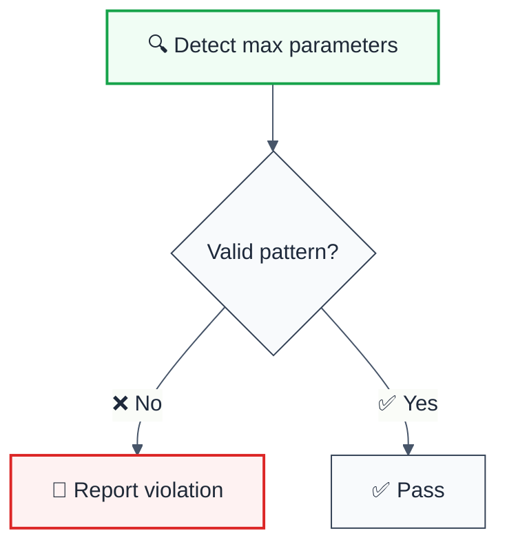

# max-parameters

> **Keywords:** max parameters, quality, ESLint rule, JavaScript, TypeScript, SonarQube RSPEC-107
**CWE:** [CWE-693](https://cwe.mitre.org/data/definitions/693.html)

ESLint Rule: max-parameters with LLM-optimized suggestions and auto-fix capabilities.

## Quick Summary

| Aspect         | Details                                      |
| -------------- | -------------------------------------------- |
| **Severity**   | Error (code quality)                        |
| **Auto-Fix**   | ❌ No                                        |
| **Category**   | Quality |
| **ESLint MCP** | ✅ Optimized for ESLint MCP integration      |
| **Best For**   | Production applications                      |
| **Suggestions** | ✅ 4 available           |

## Rule Details



### Why This Matters

| Issue                | Impact                                | Solution                    |
| -------------------- | ------------------------------------- | --------------------------- |
| 🔒 **Security/Code Quality** | [Specific issue] | [Solution approach] |
| 🐛 **Maintainability** | [Impact] | [Fix] |
| ⚡ **Performance**   | [Impact] | [Optimization] |

## Configuration

**No configuration options available.**

## Examples

### ❌ Incorrect

```typescript
// Example of incorrect usage
```

### ✅ Correct

```typescript
// Example of correct usage
```

## Configuration Examples

### Basic Usage

```javascript
// eslint.config.mjs
export default [
  {
    rules: {
      'quality/max-parameters': 'error',
    },
  },
];
```

## LLM-Optimized Output

```
🚨 max parameters | Description | MEDIUM
   Fix: Suggestion | Reference
```

## Related Rules

- [`rule-name`](./rule-name.md) - Description

## Known False Negatives

The following patterns are **not detected** due to static analysis limitations:

### Values from Variables

**Why**: Static analysis cannot trace values stored in variables.

```typescript
// ❌ NOT DETECTED - Value from variable
const value = userInput;
dangerousOperation(value);
```

**Mitigation**: Implement runtime validation and review code manually.

### Custom Wrapper Functions

**Why**: Custom wrapper functions are not recognized.

```typescript
// ❌ NOT DETECTED - Custom wrapper
myCustomWrapper(sensitiveData); // Uses insecure API internally
```

**Mitigation**: Apply this rule's principles to wrapper function implementations.

### Dynamic Property Access

**Why**: Dynamic property access cannot be statically analyzed.

```typescript
// ❌ NOT DETECTED - Dynamic access
obj[methodName](data);
```

**Mitigation**: Avoid dynamic method invocation with sensitive operations.


## Further Reading

- **[Reference](https://example.com)** - Description
