# no-nested-ternary

> **Keywords:** ternary, conditional, nested, readability, ESLint rule, code quality, refactoring, LLM-optimized
**CWE:** [CWE-693](https://cwe.mitre.org/data/definitions/693.html)

Prevent nested ternary expressions for better readability. This rule is part of [`@eslint/eslint-plugin-quality`](https://www.npmjs.com/package/@eslint/eslint-plugin-quality) and provides LLM-optimized error messages with suggestions.

## Quick Summary

| Aspect         | Details                                                              |
| -------------- | -------------------------------------------------------------------- |
| **Severity**   | Warning (code quality)                                               |
| **Auto-Fix**   | 💡 Suggests fixes                                                    |
| **Category**   | Quality                                                              |
| **ESLint MCP** | ✅ Optimized for ESLint MCP integration                              |
| **Best For**   | All projects prioritizing readability and maintainability            |

## Rule Details

```mermaid
%%{init: {
  'theme': 'base',
  'themeVariables': {
    'primaryColor': '#f8fafc',
    'primaryTextColor': '#1e293b',
    'primaryBorderColor': '#334155',
    'lineColor': '#475569',
    'c0': '#f8fafc',
    'c1': '#f1f5f9',
    'c2': '#e2e8f0',
    'c3': '#cbd5e1'
  }
}}%%
flowchart TD
    A[🔍 Detect Ternary] --> B{Contains Nested?}
    B -->|❌ No| C[✅ Pass]
    B -->|✅ Yes| D{In Allowed Context?}
    
    D -->|✅ Yes| C
    D -->|❌ No| E[⚠️ Report: Extract or use if-else]
    
    classDef startNode fill:#f0fdf4,stroke:#16a34a,stroke-width:2px,color:#1f2937
    classDef errorNode fill:#fef2f2,stroke:#dc2626,stroke-width:2px,color:#1f2937
    classDef processNode fill:#eff6ff,stroke:#2563eb,stroke-width:2px,color:#1f2937
    
    class A startNode
    class E errorNode
    class C processNode
```



### Why This Matters

| Issue                     | Impact                          | Solution                  |
| ------------------------- | ------------------------------- | ------------------------- |
| 📖 **Readability**        | Hard to follow logic            | Use if-else or extract    |
| 🐛 **Bug Risk**           | Easy to make mistakes           | Simpler constructs        |
| 🔄 **Maintainability**    | Difficult to modify             | Break into steps          |
| 👀 **Code Review**        | Harder to review                | Clearer structure         |

## Configuration

| Option  | Type       | Default | Description                              |
| ------- | ---------- | ------- | ---------------------------------------- |
| `allow` | `string[]` | `[]`    | Contexts where nested ternaries allowed  |

## Examples

### ❌ Incorrect

```typescript
// Nested ternary in consequent
const result = condition1
  ? condition2
    ? value1
    : value2
  : value3;

// Nested ternary in alternate
const status = isActive
  ? 'active'
  : isPending
    ? 'pending'
    : 'inactive';

// Multiple levels of nesting
const color = size === 'large'
  ? 'red'
  : size === 'medium'
    ? 'blue'
    : size === 'small'
      ? 'green'
      : 'gray';
```

### ✅ Correct

```typescript
// Single ternary
const result = condition ? value1 : value2;

// Use if-else for complex logic
let status: string;
if (isActive) {
  status = 'active';
} else if (isPending) {
  status = 'pending';
} else {
  status = 'inactive';
}

// Extract to helper function
function getColor(size: string): string {
  if (size === 'large') return 'red';
  if (size === 'medium') return 'blue';
  if (size === 'small') return 'green';
  return 'gray';
}
const color = getColor(size);

// Use object lookup
const colorMap: Record<string, string> = {
  large: 'red',
  medium: 'blue',
  small: 'green',
};
const color = colorMap[size] ?? 'gray';

// Use switch for multiple conditions
function getStatusColor(status: string): string {
  switch (status) {
    case 'success': return 'green';
    case 'warning': return 'yellow';
    case 'error': return 'red';
    default: return 'gray';
  }
}
```

## Configuration Examples

### Basic Usage

```javascript
{
  rules: {
    'quality/no-nested-ternary': 'warn'
  }
}
```

### Strict Mode

```javascript
{
  rules: {
    'quality/no-nested-ternary': 'error'
  }
}
```

## Refactoring Patterns

### Pattern 1: Extract to Variable

```typescript
// ❌ Before
const message = user.isAdmin
  ? user.isActive
    ? 'Active Admin'
    : 'Inactive Admin'
  : 'Regular User';

// ✅ After
const adminStatus = user.isActive ? 'Active Admin' : 'Inactive Admin';
const message = user.isAdmin ? adminStatus : 'Regular User';
```

### Pattern 2: Extract to Function

```typescript
// ❌ Before
const discount = isPremium
  ? totalAmount > 100
    ? 0.2
    : 0.1
  : 0;

// ✅ After
function calculateDiscount(isPremium: boolean, totalAmount: number): number {
  if (!isPremium) return 0;
  return totalAmount > 100 ? 0.2 : 0.1;
}
const discount = calculateDiscount(isPremium, totalAmount);
```

### Pattern 3: Use Object Lookup

```typescript
// ❌ Before
const icon = status === 'success'
  ? '✓'
  : status === 'error'
    ? '✗'
    : status === 'warning'
      ? '⚠'
      : '•';

// ✅ After
const statusIcons: Record<string, string> = {
  success: '✓',
  error: '✗',
  warning: '⚠',
};
const icon = statusIcons[status] ?? '•';
```

### Pattern 4: Early Returns

```typescript
// ❌ Before
const getButtonClass = (variant, disabled) =>
  disabled
    ? 'btn-disabled'
    : variant === 'primary'
      ? 'btn-primary'
      : 'btn-secondary';

// ✅ After
function getButtonClass(variant: string, disabled: boolean): string {
  if (disabled) return 'btn-disabled';
  if (variant === 'primary') return 'btn-primary';
  return 'btn-secondary';
}
```

## When Not To Use

| Scenario                    | Recommendation                              |
| --------------------------- | ------------------------------------------- |
| 🎯 **Very simple cases**    | Still discouraged but may be acceptable     |
| ⚛️ **JSX conditionals**     | Consider component extraction               |
| 📊 **Type narrowing**       | TypeScript may require specific patterns    |

## Comparison with Alternatives

| Feature              | no-nested-ternary   | ESLint built-in      | unicorn              |
| -------------------- | ------------------- | -------------------- | -------------------- |
| **Deep nesting**     | ✅ All levels       | ✅ Yes               | ✅ Yes               |
| **JSX detection**    | ✅ Yes              | ❌ No                | ⚠️ Limited           |
| **LLM-Optimized**    | ✅ Yes              | ❌ No                | ❌ No                |
| **ESLint MCP**       | ✅ Optimized        | ❌ No                | ❌ No                |
| **Suggestions**      | ✅ Yes              | ❌ No                | ⚠️ Limited           |

## Related Rules

- [`cognitive-complexity`](./cognitive-complexity.md) - Overall code complexity
- [`no-lonely-if`](./no-lonely-if.md) - Simplify if statements

## Known False Negatives

The following patterns are **not detected** due to static analysis limitations:

### Values from Variables

**Why**: Static analysis cannot trace values stored in variables.

```typescript
// ❌ NOT DETECTED - Value from variable
const value = userInput;
dangerousOperation(value);
```

**Mitigation**: Implement runtime validation and review code manually.

### Custom Wrapper Functions

**Why**: Custom wrapper functions are not recognized.

```typescript
// ❌ NOT DETECTED - Custom wrapper
myCustomWrapper(sensitiveData); // Uses insecure API internally
```

**Mitigation**: Apply this rule's principles to wrapper function implementations.

### Dynamic Property Access

**Why**: Dynamic property access cannot be statically analyzed.

```typescript
// ❌ NOT DETECTED - Dynamic access
obj[methodName](data);
```

**Mitigation**: Avoid dynamic method invocation with sensitive operations.


## Further Reading

- **[ESLint no-nested-ternary](https://eslint.org/docs/latest/rules/no-nested-ternary)** - Built-in ESLint rule
- **[unicorn no-nested-ternary](https://github.com/sindresorhus/eslint-plugin-unicorn/blob/main/docs/rules/no-nested-ternary.md)** - Unicorn implementation
- **[Clean Code](https://www.amazon.com/Clean-Code-Handbook-Software-Craftsmanship/dp/0132350882)** - Code readability principles
- **[ESLint MCP Setup](https://eslint.org/docs/latest/use/mcp)** - Enable AI assistant integration

