---
title: no-access-state-in-setstate
description: no-access-state-in-setstate rule
category: quality
severity: low
tags: ['quality', 'react']
autofix: suggestions
affects: ['readability', 'maintainability']
effort: low
---# no-access-state-in-setstate

> **Keywords:** React, setState, this.state, functional updates, race conditions, class components, ESLint rule, LLM-optimized

Disallows accessing `this.state` inside `setState` calls to prevent race conditions. This rule is part of [`@eslint/eslint-plugin-react-features`](https://www.npmjs.com/package/@eslint/eslint-plugin-react-features) and provides LLM-optimized error messages.

## Quick Summary

| Aspect         | Details                                                              |
| -------------- | -------------------------------------------------------------------- |
| **Severity**   | High (potential bugs)                                                |
| **Auto-Fix**   | ❌ No (requires functional setState)                                 |
| **Category**   | React                                                                |
| **ESLint MCP** | ✅ Optimized for ESLint MCP integration                              |
| **Best For**   | React class components, preventing async state bugs                  |

## Rule Details

```mermaid
%%{init: {
  'theme': 'base',
  'themeVariables': {
    'primaryColor': '#f8fafc',
    'primaryTextColor': '#1e293b',
    'primaryBorderColor': '#334155',
    'lineColor': '#475569'
  }
}}%%
flowchart TD
    A[🔍 Check setState call] --> B{Argument accesses this.state?}
    B -->|❌ No| C[✅ Pass]
    B -->|✅ Yes| D[⚠️ Report: Use functional setState]
    
    classDef startNode fill:#f0fdf4,stroke:#16a34a,stroke-width:2px,color:#1f2937
    classDef errorNode fill:#fef2f2,stroke:#dc2626,stroke-width:2px,color:#1f2937
    classDef processNode fill:#eff6ff,stroke:#2563eb,stroke-width:2px,color:#1f2937
    
    class A startNode
    class D errorNode
    class C processNode
```



### Why This Matters

| Issue                   | Impact                          | Solution                       |
| ----------------------- | ------------------------------- | ------------------------------ |
| 🏃 **Race Conditions**  | State may be stale              | Use functional updates         |
| 🔄 **Batched Updates**  | Multiple updates may conflict   | Use prevState parameter        |
| 🐛 **Intermittent Bugs**| Hard to reproduce issues        | Guaranteed latest state        |
| 📊 **Lost Updates**     | Counter increments missed       | Proper state transitions       |

## Examples

### ❌ Incorrect

```jsx
class Counter extends React.Component {
  state = { count: 0 };

  // Race condition: this.state.count may be stale
  increment = () => {
    this.setState({ count: this.state.count + 1 });
  };

  // Multiple updates may conflict
  incrementTwice = () => {
    this.setState({ count: this.state.count + 1 });
    this.setState({ count: this.state.count + 1 }); // Still uses original count!
  };

  // Complex state access
  updateState = () => {
    this.setState({
      items: [...this.state.items, newItem],
      count: this.state.items.length + 1
    });
  };
}
```

### ✅ Correct

```jsx
class Counter extends React.Component {
  state = { count: 0 };

  // Functional update: guaranteed latest state
  increment = () => {
    this.setState(prevState => ({ count: prevState.count + 1 }));
  };

  // Both updates work correctly
  incrementTwice = () => {
    this.setState(prevState => ({ count: prevState.count + 1 }));
    this.setState(prevState => ({ count: prevState.count + 1 }));
  };

  // Complex state with prevState
  updateState = () => {
    this.setState(prevState => ({
      items: [...prevState.items, newItem],
      count: prevState.items.length + 1
    }));
  };

  // Setting independent state is fine
  setName = (name) => {
    this.setState({ name }); // OK: not dependent on previous state
  };
}
```

## Configuration

```javascript
{
  rules: {
    'react-features/no-access-state-in-setstate': 'error'
  }
}
```

## The Problem Explained

```jsx
// Initial state: { count: 0 }

// Imagine rapid button clicks:
handleClick = () => {
  // ❌ Problem: this.state.count is captured at call time
  this.setState({ count: this.state.count + 1 }); // count: 0 + 1 = 1
  this.setState({ count: this.state.count + 1 }); // count: 0 + 1 = 1 (still 0!)
  this.setState({ count: this.state.count + 1 }); // count: 0 + 1 = 1 (still 0!)
  // Final count: 1 (expected: 3)
};

// ✅ Solution: use functional updates
handleClick = () => {
  this.setState(prev => ({ count: prev.count + 1 })); // count: 0 + 1 = 1
  this.setState(prev => ({ count: prev.count + 1 })); // count: 1 + 1 = 2
  this.setState(prev => ({ count: prev.count + 1 })); // count: 2 + 1 = 3
  // Final count: 3 ✓
};
```

## When to Use Functional Updates

| Pattern                        | Use Functional Update |
| ------------------------------ | --------------------- |
| Incrementing/decrementing      | ✅ Yes                |
| Toggle boolean                 | ✅ Yes                |
| Array push/filter              | ✅ Yes                |
| Set independent value          | ❌ Not required       |
| Reset to initial state         | ❌ Not required       |

## Migration to Hooks

```jsx
// Class component with this issue
class Counter extends React.Component {
  state = { count: 0 };
  increment = () => {
    this.setState(prevState => ({ count: prevState.count + 1 }));
  };
}

// Function component - same pattern works
function Counter() {
  const [count, setCount] = useState(0);
  
  const increment = () => {
    setCount(prevCount => prevCount + 1);
  };
}
```

## Related Rules

- [`no-set-state`](./no-set-state.md) - Discourage setState usage
- [`no-did-mount-set-state`](./no-did-mount-set-state.md) - No setState in componentDidMount
- [`no-did-update-set-state`](./no-did-update-set-state.md) - No setState in componentDidUpdate

## Further Reading

- **[setState Documentation](https://react.dev/reference/react/Component#setstate)** - React docs
- **[Functional Updates](https://react.dev/reference/react/useState#updating-state-based-on-the-previous-state)** - React hooks pattern
- **[ESLint MCP Setup](https://eslint.org/docs/latest/use/mcp)** - Enable AI assistant integration
## Known False Negatives

The following patterns are **not detected** due to static analysis limitations:

### Dynamic Variable References

**Why**: Static analysis cannot trace values stored in variables or passed through function parameters.

```typescript
// ❌ NOT DETECTED - Prop from variable
const propValue = computedValue;
<Component prop={propValue} /> // Computation not analyzed
```

**Mitigation**: Implement runtime validation and review code manually. Consider using TypeScript branded types for validated inputs.

### Wrapped or Aliased Functions

**Why**: Custom wrapper functions or aliased methods are not recognized by the rule.

```typescript
// ❌ NOT DETECTED - Custom wrapper
function myWrapper(data) {
  return internalApi(data); // Wrapper not analyzed
}
myWrapper(unsafeInput);
```

**Mitigation**: Apply this rule's principles to wrapper function implementations. Avoid aliasing security-sensitive functions.

### Imported Values

**Why**: When values come from imports, the rule cannot analyze their origin or construction.

```typescript
// ❌ NOT DETECTED - Value from import
import { getValue } from './helpers';
processValue(getValue()); // Cross-file not tracked
```

**Mitigation**: Ensure imported values follow the same constraints. Use TypeScript for type safety.


