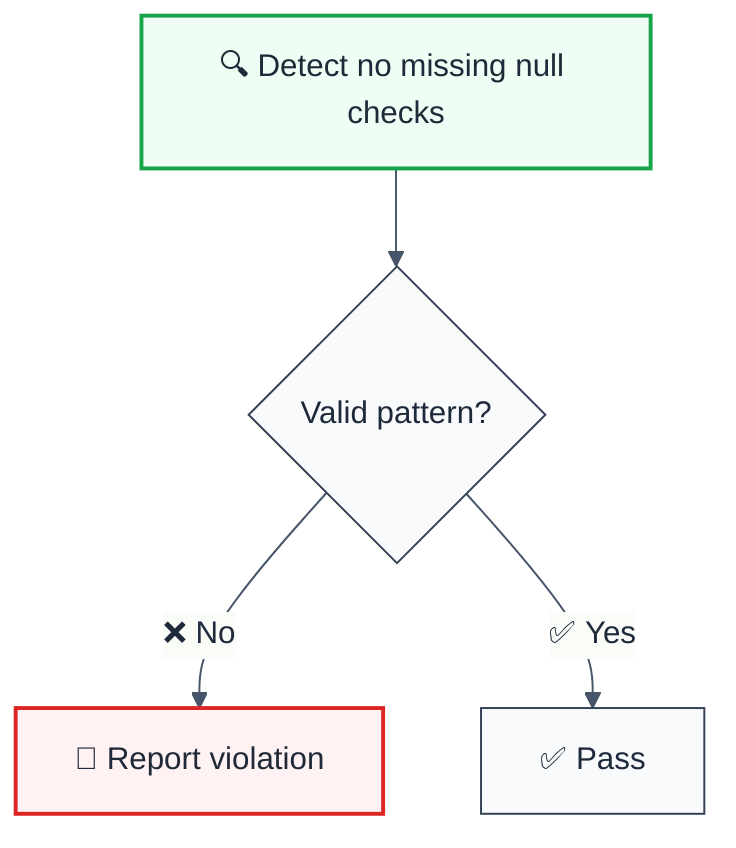

> **Keywords:** no missing null checks, quality, ESLint rule, JavaScript, TypeScript, [CWE-476](https://cwe.mitre.org/data/definitions/476.html), SonarQube RSPEC-2259


<!-- @rule-summary -->
ESLint Rule: no-missing-null-checks with LLM-optimized suggestions and auto-fix capabilities.
<!-- @/rule-summary -->

ESLint Rule: no-missing-null-checks with LLM-optimized suggestions and auto-fix capabilities.

## Quick Summary

| Aspect         | Details                                      |
| -------------- | -------------------------------------------- |
| **Severity**   | Error (code quality)                        |
| **Auto-Fix**   | ❌ No                                        |
| **Category**   | Quality |
| **ESLint MCP** | ✅ Optimized for ESLint MCP integration      |
| **Best For**   | Production applications                      |
| **Suggestions** | ✅ 4 available           |

## Rule Details



### Why This Matters

| Issue                | Impact                                | Solution                    |
| -------------------- | ------------------------------------- | --------------------------- |
| 🔒 **Security/Code Quality** | [Specific issue] | [Solution approach] |
| 🐛 **Maintainability** | [Impact] | [Fix] |
| ⚡ **Performance**   | [Impact] | [Optimization] |

### What counts as a null check

The rule reports a dereference only when this file carries **evidence** the value
may be null — `let x;` never written, `= null` / `= undefined`, or a platform
call documented to return null on a miss (`find`, `match`, `exec`,
`getElementById`, `querySelector`, …). Any of these guards clears it:

| Guard | Example |
| ----- | ------- |
| Optional chaining | `hit?.name` |
| Truthy or `!= null` test enclosing the read | `if (hit) { hit.name }`, `hit && hit.name`, `hit ? hit.name : ''` |
| Falsy guard that **leaves** before the read | `if (!hit) return; hit.name` — also `if (hit == null) throw …; hit.name`, `if (!hit \|\| stale) continue; hit.name` |
| TypeScript narrowing (type-aware mode) | `if (!page) notFound(); page.data` when `notFound(): never` |

The exiting guard must name the **same binding** as the read: an outer
`if (!hit) return` says nothing about an inner `let hit` that shadows it.

**Type-aware mode.** When `@typescript-eslint/parser` runs with `projectService`
(or `project`), the rule asks the checker for the type of the object being
dereferenced. A non-nullable type is a veto — TypeScript's control-flow
narrowing knows about `never`-returning calls, `asserts` functions and declared
return types that syntax cannot see. The veto only subtracts: a nullable type
falls through to the evidence gate above, and `any` / `unknown` carry no
information, so types never add a finding. Without type information the rule
behaves identically to the syntax-only description.

## Configuration

**No configuration options available.**

## Examples

### ❌ Incorrect

```typescript
// Example of incorrect usage
```

### ✅ Correct

```typescript
// Example of correct usage
```

## Configuration Examples

### Basic Usage

```javascript
// eslint.config.mjs
export default [
  {
    rules: {
      'reliability/no-missing-null-checks': 'error',
    },
  },
];
```

## LLM-Optimized Output

```
🚨 no missing null checks | Description | MEDIUM
   Fix: Suggestion | Reference
```

## Related Rules

- [`rule-name`](./rule-name.md) - Description

## Further Reading

- **[Reference](https://example.com)** - Description
## Known False Negatives

The following patterns are **not detected** due to static analysis limitations:

### Dynamic Variable References

**Why**: Static analysis cannot trace values stored in variables or passed through function parameters.

```typescript
// ❌ NOT DETECTED - Value from variable
const value = externalSource();
processValue(value); // Variable origin not tracked
```

**Mitigation**: Implement runtime validation and review code manually. Consider using TypeScript branded types for validated inputs.

### Wrapped or Aliased Functions

**Why**: Custom wrapper functions or aliased methods are not recognized by the rule.

```typescript
// ❌ NOT DETECTED - Custom wrapper
function myWrapper(data) {
  return internalApi(data); // Wrapper not analyzed
}
myWrapper(unsafeInput);
```

**Mitigation**: Apply this rule's principles to wrapper function implementations. Avoid aliasing security-sensitive functions.

### Imported Values

**Why**: When values come from imports, the rule cannot analyze their origin or construction.

```typescript
// ❌ NOT DETECTED - Value from import
import { getValue } from './helpers';
processValue(getValue()); // Cross-file not tracked
```

**Mitigation**: Ensure imported values follow the same constraints. Use TypeScript for type safety.