> **Keywords:** no-missing-authentication, Express, Fastify, route handler, middleware, JWT, security, ESLint rule, CWE-287, broken authentication
> **CWE:** [CWE-287: Improper Authentication](https://cwe.mitre.org/data/definitions/287.html)  
> **OWASP Mobile:** [OWASP Mobile Top 10 M3: Insecure Communication](https://owasp.org/www-project-mobile-top-10/)

ESLint Rule: no-missing-authentication. This rule is part of [`eslint-plugin-secure-coding`](https://www.npmjs.com/package/eslint-plugin-secure-coding).

## Quick Summary

| Aspect         | Details                                  |
| -------------- | ---------------------------------------- |
| **Severity**   | Critical (Broken Authentication)         |
| **Auto-Fix**   | ❌ No (requires adding middleware)       |
| **Category**   | Security |
| **ESLint MCP** | ✅ Optimized for ESLint MCP integration  |
| **Best For**   | All REST APIs and backend route handlers |

## Vulnerability and Risk

**Vulnerability:** Missing authentication checks on sensitive API routes. This occurs when an endpoint that should be restricted is exposed to unauthenticated (anonymous) users.

**Risk:** Attackers can access private data, perform actions on behalf of other users, or gain administrative control over the application. Broken authentication is one of the most common and impactful security vulnerabilities in modern web applications.

## Error Message Format

The rule provides **LLM-optimized error messages** (Compact 2-line format) with actionable security guidance:

```text
🔒 CWE-287 OWASP:M3 | Missing Authentication detected | CRITICAL [BrokenAuth]
   Fix: Add authentication middleware (e.g., authenticate()) to this route | https://cwe.mitre.org/data/definitions/287.html
```

### Message Components

| Component                 | Purpose                | Example                                                                                                             |
| :------------------------ | :--------------------- | :------------------------------------------------------------------------------------------------------------------ |
| **Risk Standards**        | Security benchmarks    | [CWE-287](https://cwe.mitre.org/data/definitions/287.html) [OWASP:M3](https://owasp.org/www-project-mobile-top-10/) |
| **Issue Description**     | Specific vulnerability | `Missing Authentication detected`                                                                                   |
| **Severity & Compliance** | Impact assessment      | `CRITICAL [BrokenAuth]`                                                                                             |
| **Fix Instruction**       | Actionable remediation | `Add authentication middleware`                                                                                     |
| **Technical Truth**       | Official reference     | [Improper Authentication](https://cwe.mitre.org/data/definitions/287.html)                                          |

## Rule Details

This rule scans route handlers in popular frameworks (Express, Fastify, etc.) and flags those that do not include a recognized authentication middleware in their middleware chain.

```mermaid
%%{init: {
  'theme': 'base',
  'themeVariables': {
    'primaryColor': '#f8fafc',
    'primaryTextColor': '#1e293b',
    'primaryBorderColor': '#334155',
    'lineColor': '#475569',
    'c0': '#f8fafc',
    'c1': '#f1f5f9',
    'c2': '#e2e8f0',
    'c3': '#cbd5e1'
  }
}}%%
flowchart TD
    A[Route Method Call e.g. .get] --> B{Contains known auth middleware?}
    B -->|Yes| C[✅ Protected Endpoint]
    B -->|No| D[🚨 Missing Authentication]
    D --> E[💡 Suggest passport/jwt/custom-auth wrap]
```



### Why This Matters

| Issue             | Impact                               | Solution                                                     |
| ----------------- | ------------------------------------ | ------------------------------------------------------------ |
| 🕵️ **Exposure**   | Private user data leaked             | Enforce authentication on EVERY non-public route             |
| 🚀 **Takeover**   | Account hijacking through API bypass | Use signed tokens (JWT) or sessions for all sensitive calls  |
| 🔒 **Compliance** | Failure to meet GDPR/SOC2 standards  | Implement a "Deny by Default" strategy for all route folders |

## Configuration

This rule supports extensive configuration to match your project's middleware naming conventions:

```javascript
{
  "rules": {
    "secure-coding/no-missing-authentication": ["error", {
      "authMiddlewarePatterns": ["authenticate", "requireAuth", "passport.authenticate"],
      "routeHandlerPatterns": ["get", "post", "put", "delete"],
      "ignorePatterns": ["/api/public/*"]
    }]
  }
}
```

## Examples

### ❌ Incorrect

```javascript
// Express route without any authentication middleware
app.get('/api/user/profile', (req, res) => {
  // ❌ VULNERABLE: Direct access to profile data
  res.json(req.user.profile);
});

// Fastify route missing protection
fastify.post('/api/settings', async (request, reply) => {
  // ❌ VULNERABLE: Anyone can change settings
  updateSettings(request.body);
});
```

### ✅ Correct

```javascript
// Using recognized authentication middleware (Express)
app.get('/api/user/profile', authenticate(), (req, res) => {
  // ✅ SECURE
  res.json(req.user.profile);
});

// Using Passport.js
app.post(
  '/api/settings',
  passport.authenticate('jwt', { session: false }),
  (req, res) => {
    // ✅ SECURE
    updateSettings(req.body);
  },
);
```

## Known False Negatives

The following patterns are **not detected** due to static analysis limitations:

### Global Middleware

**Why**: If authentication is applied globally via `app.use(authMiddleware)`, this rule might still flag individual routes because it doesn't always see the global application setup.

**Mitigation**: Use `// eslint-disable-next-line` on individual routes if global protection is active, or configure the rule to ignore specific files.

### Custom Logic Checks

**Why**: If you perform authentication _inside_ the handler function body using imperative logic instead of middleware.

```javascript
app.get('/data', (req, res) => {
  if (!req.user) return res.status(401).send(); // ❌ Rule may not see this
  ...
});
```

**Mitigation**: Always prefer middleware for authentication to ensure it runs before any business logic and is easily audited.

## References

- [CWE-287: Improper Authentication](https://cwe.mitre.org/data/definitions/287.html)
- [OWASP Authentication Cheat Sheet](https://cheatsheetseries.owasp.org/cheatsheets/Authentication_Cheat_Sheet.html)
- [Express Guide - Using Middleware](https://expressjs.com/en/guide/using-middleware.html)
