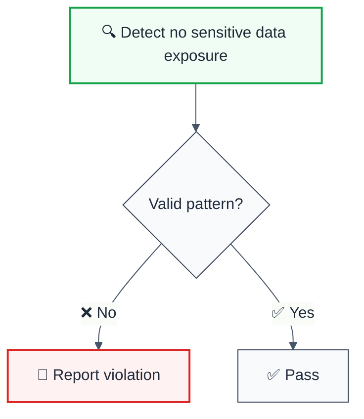

# no-sensitive-data-exposure

> **Keywords:** no sensitive data exposure, security, ESLint rule, JavaScript, TypeScript, CWE-532

ESLint Rule: no-sensitive-data-exposure. This rule is part of [`eslint-plugin-secure-coding`](https://www.npmjs.com/package/eslint-plugin-secure-coding).

## Quick Summary

| Aspect            | Details                                                                           |
| ----------------- | --------------------------------------------------------------------------------- |
| **CWE Reference** | [CWE-200](https://cwe.mitre.org/data/definitions/200.html) (Information Exposure) |
| **Severity**      | High (security vulnerability)                                                     |
| **Auto-Fix**      | ❌ No                                                                             |
| **Category**      | Security                                                                          |
| **ESLint MCP**    | ✅ Optimized for ESLint MCP integration                                           |
| **Best For**      | Applications handling PII                                                         |

## Vulnerability and Risk

**Vulnerability:** Sensitive data exposure happens when an application inadequately protects sensitive information such as passwords, financial data, or health records.

**Risk:** Attackers can access this data to conduct identity theft, credit card fraud, or further attacks on the system. It often leads to severe regulatory penalties (GDPR, PCI-DSS compliance failure).

## Rule Details



### Why This Matters

| Issue                        | Impact           | Solution            |
| ---------------------------- | ---------------- | ------------------- |
| 🔒 **Security/Code Quality** | [Specific issue] | [Solution approach] |
| 🐛 **Maintainability**       | [Impact]         | [Fix]               |
| ⚡ **Performance**           | [Impact]         | [Optimization]      |

## Configuration

**No configuration options available.**

## Examples

### ❌ Incorrect

```typescript
// Example of incorrect usage
```

### ✅ Correct

```typescript
// Example of correct usage
```

## Configuration Examples

### Basic Usage

```javascript
// eslint.config.mjs
export default [
  {
    rules: {
      'secure-coding/no-sensitive-data-exposure': 'error',
    },
  },
];
```

## LLM-Optimized Output

```
🚨 no sensitive data exposure | Description | MEDIUM
   Fix: Suggestion | Reference
```

## Related Rules

- [`rule-name`](./rule-name.md) - Description

## Known False Negatives

The following patterns are **not detected** due to static analysis limitations:

### Values from Variables

**Why**: Values stored in variables are not traced.

```typescript
// ❌ NOT DETECTED - Value from variable
const value = userInput;
dangerousOperation(value);
```

**Mitigation**: Validate all user inputs.

### Wrapper Functions

**Why**: Custom wrappers not recognized.

```typescript
// ❌ NOT DETECTED - Wrapper
myWrapper(userInput); // Uses dangerous API internally
```

**Mitigation**: Apply rule to wrapper implementations.

### Dynamic Invocation

**Why**: Dynamic calls not analyzed.

```typescript
// ❌ NOT DETECTED - Dynamic
obj[method](userInput);
```

**Mitigation**: Avoid dynamic method invocation.

## Further Reading

- **[OWASP Selective Data Exposure](https://owasp.org/www-community/vulnerabilities/Sensitive_Data_Exposure)** - Guidelines
- **[CWE-200: Exposure of Sensitive Information to an Unauthorized Actor](https://cwe.mitre.org/data/definitions/200.html)** - Official CWE entry
