# no-unvalidated-user-input

> **Keywords:** input validation, CWE-20, security, ESLint rule, user input, req.body, req.query, validation library, Zod, Joi, Yup, class-validator, OWASP, input security, auto-fix, LLM-optimized, code security

Detects unvalidated user input usage (req.body, req.query, etc.) in Express, Fastify, and Next.js applications. This rule is part of [`eslint-plugin-secure-coding`](https://www.npmjs.com/package/eslint-plugin-secure-coding) and provides LLM-optimized error messages that AI assistants can automatically fix.

⚠️ This rule **_warns_** by default in the `recommended` config.

## Quick Summary

| Aspect            | Details                                                                              |
| ----------------- | ------------------------------------------------------------------------------------ |
| **CWE Reference** | [CWE-20](https://cwe.mitre.org/data/definitions/20.html) (Improper Input Validation) |
| **Severity**      | High (security vulnerability)                                                        |
| **Auto-Fix**      | ✅ Yes (suggests validation libraries)                                               |
| **Category**      | Security                                                                             |
| **ESLint MCP**    | ✅ Optimized for ESLint MCP integration                                              |
| **Best For**      | All web applications handling user input, API endpoints, form submissions            |

## Vulnerability and Risk

**Vulnerability:** Failing to validate user input allows attackers to send malformed or malicious data to the application.
**Risk:** This is the root cause of many vulnerabilities, including SQL Injection, XSS, and Remote Code Execution. It can also lead to application crashes or logic errors if data doesn't match expected formats.

## Error Message Format

The rule provides **LLM-optimized error messages** (Compact 2-line format) with actionable security guidance:

```text
🔒 CWE-20 OWASP:A06 CVSS:7.5 | Improper Input Validation detected | HIGH [SOC2,PCI-DSS,HIPAA,GDPR,ISO27001]
   Fix: Review and apply the recommended fix | https://owasp.org/Top10/A06_2021/
```

### Message Components

| Component | Purpose | Example |
| :--- | :--- | :--- |
| **Risk Standards** | Security benchmarks | [CWE-20](https://cwe.mitre.org/data/definitions/20.html) [OWASP:A06](https://owasp.org/Top10/A06_2021-Injection/) [CVSS:7.5](https://nvd.nist.gov/vuln-metrics/cvss/v3-calculator?vector=AV:N/AC:L/PR:N/UI:N/S:U/C:H/I:H/A:H) |
| **Issue Description** | Specific vulnerability | `Improper Input Validation detected` |
| **Severity & Compliance** | Impact assessment | `HIGH [SOC2,PCI-DSS,HIPAA,GDPR,ISO27001]` |
| **Fix Instruction** | Actionable remediation | `Follow the remediation steps below` |
| **Technical Truth** | Official reference | [OWASP Top 10](https://owasp.org/Top10/A06_2021-Injection/) |

## Rule Details

Unvalidated user input is a critical security vulnerability that can lead to injection attacks, data corruption, and unauthorized access. This rule detects direct usage of user input sources without validation.

### Why This Matters

| Issue                 | Impact                             | Solution                  |
| --------------------- | ---------------------------------- | ------------------------- |
| 🔒 **Security**       | Injection attacks (SQL, XSS, etc.) | Use validation libraries  |
| 🐛 **Data Integrity** | Invalid data can corrupt systems   | Zod, Joi, Yup validation  |
| 🔐 **Type Safety**    | Runtime errors from wrong types    | Type-safe validation      |
| 📊 **Compliance**     | Violates security best practices   | Input validation required |

## Detection Patterns

The rule detects:

- **Express patterns**: `req.body`, `req.query`, `req.params`, `req.headers`, `req.cookies`
- **Fastify patterns**: `request.body`, `request.query`, `request.params`
- **Next.js patterns**: `searchParams`
- **Generic patterns**: Variables named `userInput`, `input`

## Examples

### ❌ Incorrect

```typescript
// Unvalidated Express request body
app.post('/api/users', (req, res) => {
  const { email, name } = req.body; // ❌ No validation
  // Use email and name directly
});

// Unvalidated query parameters
app.get('/api/search', (req, res) => {
  const query = req.query.q; // ❌ No validation
  // Use query directly
});

// Unvalidated route parameters
app.get('/api/users/:id', (req, res) => {
  const userId = req.params.id; // ❌ No validation
  // Use userId directly
});
```

### ✅ Correct

```typescript
// Validated with Zod
import { z } from 'zod';

const userSchema = z.object({
  email: z.string().email(),
  name: z.string().min(1),
});

app.post('/api/users', (req, res) => {
  const data = userSchema.parse(req.body); // ✅ Validated
  // Use data safely
});

// Validated with Joi
import Joi from 'joi';

const querySchema = Joi.object({
  q: Joi.string().required(),
});

app.get('/api/search', (req, res) => {
  const { value } = querySchema.validate(req.query); // ✅ Validated
  // Use value safely
});

// Validated with class-validator
import { IsString, IsUUID } from 'class-validator';

class UserParams {
  @IsUUID()
  id!: string;
}

app.get('/api/users/:id', (req, res) => {
  const params = plainToClass(UserParams, req.params);
  validate(params); // ✅ Validated
  // Use params safely
});
```

## Configuration

```javascript
{
  rules: {
    'secure-coding/no-unvalidated-user-input': ['error', {
      allowInTests: false,                    // Allow in test files
      trustedLibraries: ['zod', 'joi', 'yup', 'class-validator'], // Trusted validation libraries
      ignorePatterns: []                     // Additional safe patterns to ignore
    }]
  }
}
```

## Options

| Option             | Type       | Default                                    | Description                               |
| ------------------ | ---------- | ------------------------------------------ | ----------------------------------------- |
| `allowInTests`     | `boolean`  | `false`                                    | Allow unvalidated input in test files     |
| `trustedLibraries` | `string[]` | `['zod', 'joi', 'yup', 'class-validator']` | Trusted validation libraries to recognize |
| `ignorePatterns`   | `string[]` | `[]`                                       | Additional safe patterns to ignore        |

## Rule Logic Flow

```mermaid
%%{init: {
  'theme': 'base',
  'themeVariables': {
    'primaryColor': '#f8fafc',
    'primaryTextColor': '#1e293b',
    'primaryBorderColor': '#334155',
    'lineColor': '#475569',
    'c0': '#f8fafc',
    'c1': '#f1f5f9',
    'c2': '#e2e8f0',
    'c3': '#cbd5e1'
  }
}}%%
flowchart TD
    A[🔍 MemberExpression/Identifier Found] --> B{In Test File?}
    B -->|Yes & allowInTests| C[✅ Skip]
    B -->|No| D{Matches Ignore Pattern?}
    D -->|Yes| C
    D -->|No| E{Check Input Patterns}
    E --> F{req.body/query/params?}
    F -->|Yes| G{Inside Validation Call?}
    F -->|No| H{userInput/input?}
    H -->|Yes| G
    H -->|No| C
    G -->|Yes| C
    G -->|No| I[🚨 Report Error]
    I --> J[💡 Suggest Fixes]
    J --> K[Use Zod]
    J --> L[Use Joi]

    classDef startNode fill:#f0fdf4,stroke:#16a34a,stroke-width:2px,color:#1f2937
    classDef errorNode fill:#fef2f2,stroke:#dc2626,stroke-width:2px,color:#1f2937
    classDef processNode fill:#eff6ff,stroke:#2563eb,stroke-width:2px,color:#1f2937
    classDef skipNode fill:#f1f5f9,stroke:#64748b,stroke-width:2px,color:#1f2937

    class A startNode
    class I errorNode
    class E,F,G,H processNode
    class C skipNode
```



## Best Practices

### 1. Use Zod for Type-Safe Validation

```typescript
import { z } from 'zod';

const userSchema = z.object({
  email: z.string().email(),
  age: z.number().int().min(18),
});

app.post('/api/users', (req, res) => {
  try {
    const data = userSchema.parse(req.body);
    // Use validated data
  } catch (error) {
    res.status(400).json({ error: 'Invalid input' });
  }
});
```

### 2. Use Joi for Flexible Validation

```typescript
import Joi from 'joi';

const schema = Joi.object({
  email: Joi.string().email().required(),
  name: Joi.string().min(1).required(),
});

app.post('/api/users', (req, res) => {
  const { error, value } = schema.validate(req.body);
  if (error) {
    return res.status(400).json({ error: error.details[0].message });
  }
  // Use validated value
});
```

### 3. Use class-validator for DTOs

```typescript
import { IsString, IsEmail, MinLength } from 'class-validator';
import { plainToClass } from 'class-transformer';
import { validate } from 'class-validator';

class CreateUserDto {
  @IsEmail()
  email!: string;

  @IsString()
  @MinLength(1)
  name!: string;
}

app.post('/api/users', async (req, res) => {
  const dto = plainToClass(CreateUserDto, req.body);
  const errors = await validate(dto);
  if (errors.length > 0) {
    return res.status(400).json({ errors });
  }
  // Use validated dto
});
```

## Known False Negatives

The following patterns are **not detected** due to static analysis limitations:

### Values from Variables

**Why**: Values stored in variables are not traced.

```typescript
// ❌ NOT DETECTED - Value from variable
const value = userInput;
dangerousOperation(value);
```

**Mitigation**: Validate all user inputs.

### Wrapper Functions

**Why**: Custom wrappers not recognized.

```typescript
// ❌ NOT DETECTED - Wrapper
myWrapper(userInput); // Uses dangerous API internally
```

**Mitigation**: Apply rule to wrapper implementations.

### Dynamic Invocation

**Why**: Dynamic calls not analyzed.

```typescript
// ❌ NOT DETECTED - Dynamic
obj[method](userInput);
```

**Mitigation**: Avoid dynamic method invocation.

## Related Rules

- [`no-unsanitized-html`](./no-unsanitized-html.md) - Detects unsanitized HTML injection
- [`no-unescaped-url-parameter`](./no-unescaped-url-parameter.md) - Detects unescaped URL parameters
- [`no-sql-injection`](./no-sql-injection.md) - Detects SQL injection vulnerabilities
- [`database-injection`](./database-injection.md) - Detects database injection vulnerabilities

## Resources

- [CWE-20: Improper Input Validation](https://cwe.mitre.org/data/definitions/20.html)
- [OWASP Input Validation Cheat Sheet](https://cheatsheetseries.owasp.org/cheatsheets/Input_Validation_Cheat_Sheet.html)
- [Zod Documentation](https://zod.dev/)
- [Joi Documentation](https://joi.dev/)
- [class-validator Documentation](https://github.com/typestack/class-validator)
