> **Keywords:** no weak password recovery, security, ESLint rule, JavaScript, TypeScript, CWE-640, CWE-620, authentication, ATO, tokens

<!-- @rule-summary -->
ESLint Rule: no-weak-password-recovery with LLM-optimized suggestions and auto-fix capabilities
<!-- @/rule-summary -->

**CWE:** [CWE-798](https://cwe.mitre.org/data/definitions/798.html)  
**OWASP Mobile:** [M1: Improper Credential Usage](https://owasp.org/www-project-mobile-top-10/)

ESLint Rule: no-weak-password-recovery with LLM-optimized suggestions and auto-fix capabilities. This rule is part of [`eslint-plugin-secure-coding`](https://www.npmjs.com/package/eslint-plugin-secure-coding).

## Quick Summary

| Aspect            | Details                                                                             |
| ----------------- | ----------------------------------------------------------------------------------- |
| **CWE Reference** | [CWE-640](https://cwe.mitre.org/data/definitions/640.html) (Weak Password Recovery) |
| **Severity**      | Error (Security)                                                                    |
| **Auto-Fix**      | ❌ No                                                                               |
| **Category**   | Security |
| **ESLint MCP**    | ✅ Optimized for ESLint MCP integration                                             |
| **Best For**      | Authentication systems, User management                                             |
| **Suggestions**   | ✅ Advice on secure token generation                                                |

## Vulnerability and Risk

**Vulnerability:** Weak password recovery mechanisms allow attackers to reset user passwords without proper authorization. This typically involves predictable reset tokens (e.g., sequential IDs, timestamps, weak random) or insecure channels (e.g., sending the new password effectively in cleartext over email).

**Risk:** Account Takeover (ATO). If an attacker can guess or brute-force the reset token, they can change the victim's password and lock them out of their account, gaining full access to their data and capabilities.

## Rule Details

This rule scans for weak password recovery mechanisms, such as:

1.  **Low Entropy Tokens**: Tokens that are easy to guess or predict (e.g., using `Math.random()` or timestamps).
2.  **No Expiration**: Recovery links that valid indefinitely.
3.  **Knowledge-Based Authentication (KBA)**: Using security questions like "What is your mother's maiden name?" which are easily researchable.

Account Takeover (ATO) often happens via weak recovery flows rather than cracking the main password.

```mermaid
%%{init: {
  'theme': 'base',
  'themeVariables': {
    'primaryColor': '#f8fafc',
    'primaryTextColor': '#1e293b',
    'primaryBorderColor': '#334155',
    'lineColor': '#475569',
    'c0': '#f6ffed',
    'c1': '#f1f5f9',
    'c2': '#e2e8f0',
    'c3': '#cbd5e1'
  }
}}%%
flowchart TD
    User[User] -->|Forgot Password| App{Application}
    App -->|Generate Weak Token| WeakToken[Random/Number]
    App -->|Generate Strong Token| StrongToken[Crypto Random 32 bytes]

    WeakToken -->|Brute Force / Prediction| Attacker[🕵️ Attacker]
    StrongToken -->|High Entropy| Secure[🔒 Secure Reset]

    Attacker -->|Takeover Account| ATO[💥 Account Takeover]

    classDef startNode fill:#f0fdf4,stroke:#16a34a,stroke-width:2px,color:#1f2937
    classDef errorNode fill:#fef2f2,stroke:#dc2626,stroke-width:2px,color:#1f2937

    class App startNode
    class ATO errorNode
```



### Why This Matters

| Issue           | Impact                         | Solution                 |
| --------------- | ------------------------------ | ------------------------ |
| 🔒 **Security** | Account Takeover (CWE-640)     | Use CSPRNG for tokens    |
| 🛡️ **Privacy**  | Personal data exposure via KBA | Avoid security questions |

## Configuration

This rule accepts an options object:

```typescript
{
  "rules": {
    "secure-coding/no-weak-password-recovery": ["error", {
      // Minimum bits of entropy for tokens (default: 128)
      "minTokenEntropy": 128,

      // Maximum lifetime of recovery tokens in hours (default: 1)
      "maxTokenLifetimeHours": 1,

      // Functions considered secure for token generation (default: randomBytes, uuidv4, etc.)
      "secureTokenFunctions": ["randomBytes", "uuidv4", "uid"],

      // Keywords to identify recovery flows
      "recoveryKeywords": ["forgot", "recover", "reset", "password"]
    }]
  }
}
```

## Examples

### ❌ Incorrect

```typescript
// Weak token generation
const resetToken = Math.random().toString(36);

// Relying on timestamps
const token = Date.now() + userId;

// KBA (Knowledge Based Authentication)
if (answer === user.securityAnswer) {
  allowReset();
}
```

### ✅ Correct

```typescript
// Cryptographically secure token
import { randomBytes } from 'crypto';
const token = randomBytes(32).toString('hex');

// Token with expiration
const resetToken = {
  token: randomBytes(32).toString('hex'),
  expiresAt: Date.now() + 3600000, // 1 hour
  userId: user.id,
};
await db.passwordResets.create(resetToken);

// Rate limiting
import rateLimit from 'express-rate-limit';
const resetLimiter = rateLimit({
  windowMs: 15 * 60 * 1000, // 15 minutes
  max: 3, // 3 requests per window
});
app.post('/reset-password', resetLimiter, async (req, res) => {
  // Implementation
});

// Validate token on use
const reset = await db.passwordResets.findOne({ token });
if (!reset || reset.expiresAt < Date.now()) {
  throw new Error('Invalid or expired token');
}
```

## Configuration

```javascript
{
  rules: {
    'secure-coding/no-weak-password-recovery': ['error', {
      minTokenEntropy: 128,
      maxTokenLifetimeHours: 24,
      recoveryKeywords: ['reset', 'recover', 'forgot', 'password'],
      secureTokenFunctions: ['randomBytes', 'crypto.randomUUID']
    }]
  }
}
```

## Options

| Option                  | Type       | Default                          | Description                       |
| ----------------------- | ---------- | -------------------------------- | --------------------------------- |
| `minTokenEntropy`       | `number`   | `128`                            | Minimum token entropy bits        |
| `maxTokenLifetimeHours` | `number`   | `24`                             | Maximum token lifetime            |
| `recoveryKeywords`      | `string[]` | `['reset', 'recover', 'forgot']` | Recovery-related keywords         |
| `secureTokenFunctions`  | `string[]` | `['randomBytes']`                | Secure token generation functions |

## Error Message Format

```
🔒 CWE-640 OWASP:A07-Auth CVSS:9.8 | Weak Password Recovery | CRITICAL [SOC2,PCI-DSS,HIPAA]
   Fix: Use cryptographically secure tokens with expiration | https://cwe.mitre.org/...
```

## Known False Negatives

The following patterns are **not detected** due to static analysis limitations:

### Credentials from Config

**Why**: Config values not traced.

```typescript
// ❌ NOT DETECTED - From config
const password = config.dbPassword;
```

**Mitigation**: Use proper secrets management.

### Environment Variables

**Why**: Env var content not analyzed.

```typescript
// ❌ NOT DETECTED - Env var
const secret = process.env.API_KEY;
```

**Mitigation**: Never hardcode or expose secrets.

### Dynamic Credential Access

**Why**: Dynamic property access not traced.

```typescript
// ❌ NOT DETECTED - Dynamic
const cred = credentials[type];
```

**Mitigation**: Audit all credential access patterns.

## Further Reading

- **[OWASP Forgot Password](https://cheatsheetseries.owasp.org/cheatsheets/Forgot_Password_Cheat_Sheet.html)** - Password recovery cheat sheet
- **[CWE-640](https://cwe.mitre.org/data/definitions/640.html)** - Weak password recovery
- **[ASVS Password Reset](https://github.com/OWASP/ASVS)** - Verification standard

## Related Rules

- [`no-hardcoded-credentials`](./no-hardcoded-credentials.md) - Hardcoded credentials
- [`no-insufficient-random`](./no-insufficient-random.md) - Weak random generation