> **Keywords:** require-backend-authorization, client-side, server-side, access control, security, ESLint rule, CWE-602, authorization bypass
> **CWE:** [CWE-602: Client-Side Enforcement of Server-Side Security](https://cwe.mitre.org/data/definitions/602.html)  
> **OWASP Mobile:** [OWASP Mobile Top 10 M3: Insecure Communication](https://owasp.org/www-project-mobile-top-10/)


<!-- @rule-summary -->
CWE: [CWE-602](https://cwe.mitre.org/data/definitions/602.html)
<!-- @/rule-summary -->

ESLint Rule: require-backend-authorization. This rule is part of [`eslint-plugin-secure-coding`](https://www.npmjs.com/package/eslint-plugin-secure-coding).

## Quick Summary

| Aspect         | Details                                   |
| -------------- | ----------------------------------------- |
| **Severity**   | Critical (Authorization Bypass)           |
| **Auto-Fix**   | ❌ No (requires architectural change)     |
| **Category**   | Security |
| **ESLint MCP** | ✅ Optimized for ESLint MCP integration   |
| **Best For**   | Web and Mobile applications with backends |

## Vulnerability and Risk

**Vulnerability:** Client-side enforcement of security occurs when critical authorization logic (e.g., "is the user an admin?") is performed only in the frontend code.

**Risk:** Attackers can easily bypass client-side checks by modifying the JavaScript code in their browser, using proxy tools, or calling backend APIs directly. Authorization MUST be enforced on the server-side for every sensitive operation.

## Error Message Format

The rule provides **LLM-optimized error messages** (Compact 2-line format) with actionable security guidance:

```text
🔒 CWE-602 OWASP:M3 | Client-Side Authorization detected | CRITICAL [AuthBypass]
   Fix: Move authorization checks to server-side API endpoints | https://cwe.mitre.org/data/definitions/602.html
```

### Message Components

| Component                 | Purpose                | Example                                                                                                             |
| :------------------------ | :--------------------- | :------------------------------------------------------------------------------------------------------------------ |
| **Risk Standards**        | Security benchmarks    | [CWE-602](https://cwe.mitre.org/data/definitions/602.html) [OWASP:M3](https://owasp.org/www-project-mobile-top-10/) |
| **Issue Description**     | Specific vulnerability | `Client-Side Authorization detected`                                                                                |
| **Severity & Compliance** | Impact assessment      | `CRITICAL [AuthBypass]`                                                                                             |
| **Fix Instruction**       | Actionable remediation | `Move checks to server-side API endpoints`                                                                          |
| **Technical Truth**       | Official reference     | [Client-Side Security](https://cwe.mitre.org/data/definitions/602.html)                                             |

## Rule Details

This rule flags common patterns where sensitive properties like `isAdmin`, `role`, or `permissions` are used in client-side conditional statements (`if` blocks) to gate functionality.

```mermaid
%%{init: {
  'theme': 'base',
  'themeVariables': {
    'primaryColor': '#f8fafc',
    'primaryTextColor': '#1e293b',
    'primaryBorderColor': '#334155',
    'lineColor': '#475569',
    'c0': '#f8fafc',
    'c1': '#f1f5f9',
    'c2': '#e2e8f0',
    'c3': '#cbd5e1'
  }
}}%%
flowchart TD
    A[Conditional Statement] --> B{Checks user.role / isAdmin?}
    B -->|Yes| C[🚨 Client-Side Auth Risk]
    B -->|No| D[✅ Standard Logic]
    C --> E[💡 Suggest Server-Side Validation]
```



### Why This Matters

| Issue               | Impact                                 | Solution                                                     |
| ------------------- | -------------------------------------- | ------------------------------------------------------------ |
| 🕵️ **Bypass**       | Attackers gain admin access            | Enforce all permissions in the API layer                     |
| 🚀 **Exfiltration** | Sensitive data exposed to unauthorized | Never send data that the user shouldn't see to the client    |
| 🔒 **Compliance**   | SOC2/ISO27001 audit failure            | Implement a Zero-Trust architecture for all backend requests |

## Configuration

This rule has no configuration options in the current version.

## Examples

### ❌ Incorrect

```javascript
// Gating sensitive UI/Logic in the frontend
if (user.role === 'ADMIN') {
  showDeleteButton();
  enableAdminConsole();
}

// Bypassing a check by changing a local variable
if (currentUser.isAdmin) {
  performSensitiveAction();
}
```

### ✅ Correct

```javascript
// Requesting data from a secure API endpoint
// The server MUST verify the user's role before returning the data or performing the action.
async function fetchData() {
  const response = await fetch('/api/admin/data');
  if (response.status === 403) {
    handleUnauthorized();
    return;
  }
  const data = await response.json();
  renderAdminUI(data);
}
```

## Known False Negatives

The following patterns are **not detected** due to static analysis limitations:

### Values from Variables

**Why**: If the role is assigned to a generic variable name, it will not be flagged.

```javascript
// ❌ NOT DETECTED
const mode = user.role;
if (mode === 'ADMIN') { ... }
```

**Mitigation**: Use consistent naming for security-related properties and audit them carefully.

### Client-Side UI Toggles

**Why**: This rule targets logic. Merely hiding a button (`display: none`) based on a role is not technically a security bypass if the underlying API is secure, but it is often indicative of poor patterns.

**Mitigation**: Always assume the client-side code is compromised and enforce everything at the network edge.

## References

- [CWE-602: Client-Side Enforcement of Server-Side Security](https://cwe.mitre.org/data/definitions/602.html)
- [OWASP: Insecure Direct Object Reference (IDOR)](https://owasp.org/www-project-top-ten/2017/A5_2017-Broken_Access_Control)